<div style="border:solid green 2px; padding: 20px"> <h1 style="color:green; margin-bottom:20px">Комментарий наставника</h1>

Привет! Спасибо, что сдал задание:) Ты проделал большую работу. Далее в файле мои комментарии ты сможешь найти в ячейках, аналогичных данной ( если рамки комментария зелёные - всё сделано правильно; жёлтые - есть замечания, но не критично; красные - нужно переделать). Не удаляй эти комментарии и постарайся учесть их в ходе выпфолнения проекта. 

</div>

# Исследование объявлений о продаже квартир

В вашем распоряжении данные сервиса Яндекс.Недвижимость — архив объявлений о продаже квартир в Санкт-Петербурге и соседних населённых пунктов за несколько лет. Нужно научиться определять рыночную стоимость объектов недвижимости. Ваша задача — установить параметры. Это позволит построить автоматизированную систему: она отследит аномалии и мошенническую деятельность. 

По каждой квартире на продажу доступны два вида данных. Первые вписаны пользователем, вторые — получены автоматически на основе картографических данных. Например, расстояние до центра, аэропорта, ближайшего парка и водоёма. 

### Шаг 1. Откройте файл с данными и изучите общую информацию. 


```python
import pandas as pd
```


```python

```


```python
data = pd.read_csv('/datasets/real_estate_data.csv', sep='\t')

```


```python
data.info()
```

    <class 'pandas.core.frame.DataFrame'>
    RangeIndex: 23699 entries, 0 to 23698
    Data columns (total 22 columns):
    total_images            23699 non-null int64
    last_price              23699 non-null float64
    total_area              23699 non-null float64
    first_day_exposition    23699 non-null object
    rooms                   23699 non-null int64
    ceiling_height          14504 non-null float64
    floors_total            23613 non-null float64
    living_area             21796 non-null float64
    floor                   23699 non-null int64
    is_apartment            2775 non-null object
    studio                  23699 non-null bool
    open_plan               23699 non-null bool
    kitchen_area            21421 non-null float64
    balcony                 12180 non-null float64
    locality_name           23650 non-null object
    airports_nearest        18157 non-null float64
    cityCenters_nearest     18180 non-null float64
    parks_around3000        18181 non-null float64
    parks_nearest           8079 non-null float64
    ponds_around3000        18181 non-null float64
    ponds_nearest           9110 non-null float64
    days_exposition         20518 non-null float64
    dtypes: bool(2), float64(14), int64(3), object(3)
    memory usage: 3.7+ MB


Описание данных
- airports_nearest — расстояние до ближайшего аэропорта в метрах (м)
- balcony — число балконов
- ceiling_height — высота потолков (м)
- cityCenters_nearest — расстояние до центра города (м)
- days_exposition — сколько дней было размещено объявление (от публикации до снятия)
- first_day_exposition — дата публикации
- floor — этаж
- floors_total — всего этажей в доме
- is_apartment — апартаменты (булев тип)
- kitchen_area — площадь кухни в квадратных метрах (м²)
- last_price — цена на момент снятия с публикации
- living_area — жилая площадь в квадратных метрах(м²)
- locality_name — название населённого пункта
- open_plan — свободная планировка (булев тип)
- parks_around3000 — число парков в радиусе 3 км
- parks_nearest — расстояние до ближайшего парка (м)
- ponds_around3000 — число водоёмов в радиусе 3 км
- ponds_nearest — расстояние до ближайшего водоёма (м)
- rooms — число комнат
- studio — квартира-студия (булев тип)
- total_area — площадь квартиры в квадратных метрах (м²)
- total_images — число фотографий квартиры в объявлении


```python
data.head(5)
```


<div>
<style scoped>
    .dataframe tbody tr th:only-of-type {
        vertical-align: middle;
    }

    .dataframe tbody tr th {
        vertical-align: top;
    }

    .dataframe thead th {
        text-align: right;
    }
</style>
<table border="1" class="dataframe">
  <thead>
    <tr style="text-align: right;">
      <th></th>
      <th>total_images</th>
      <th>last_price</th>
      <th>total_area</th>
      <th>first_day_exposition</th>
      <th>rooms</th>
      <th>ceiling_height</th>
      <th>floors_total</th>
      <th>living_area</th>
      <th>floor</th>
      <th>is_apartment</th>
      <th>...</th>
      <th>kitchen_area</th>
      <th>balcony</th>
      <th>locality_name</th>
      <th>airports_nearest</th>
      <th>cityCenters_nearest</th>
      <th>parks_around3000</th>
      <th>parks_nearest</th>
      <th>ponds_around3000</th>
      <th>ponds_nearest</th>
      <th>days_exposition</th>
    </tr>
  </thead>
  <tbody>
    <tr>
      <td>0</td>
      <td>20</td>
      <td>13000000.0</td>
      <td>108.0</td>
      <td>2019-03-07T00:00:00</td>
      <td>3</td>
      <td>2.70</td>
      <td>16.0</td>
      <td>51.0</td>
      <td>8</td>
      <td>NaN</td>
      <td>...</td>
      <td>25.0</td>
      <td>NaN</td>
      <td>Санкт-Петербург</td>
      <td>18863.0</td>
      <td>16028.0</td>
      <td>1.0</td>
      <td>482.0</td>
      <td>2.0</td>
      <td>755.0</td>
      <td>NaN</td>
    </tr>
    <tr>
      <td>1</td>
      <td>7</td>
      <td>3350000.0</td>
      <td>40.4</td>
      <td>2018-12-04T00:00:00</td>
      <td>1</td>
      <td>NaN</td>
      <td>11.0</td>
      <td>18.6</td>
      <td>1</td>
      <td>NaN</td>
      <td>...</td>
      <td>11.0</td>
      <td>2.0</td>
      <td>посёлок Шушары</td>
      <td>12817.0</td>
      <td>18603.0</td>
      <td>0.0</td>
      <td>NaN</td>
      <td>0.0</td>
      <td>NaN</td>
      <td>81.0</td>
    </tr>
    <tr>
      <td>2</td>
      <td>10</td>
      <td>5196000.0</td>
      <td>56.0</td>
      <td>2015-08-20T00:00:00</td>
      <td>2</td>
      <td>NaN</td>
      <td>5.0</td>
      <td>34.3</td>
      <td>4</td>
      <td>NaN</td>
      <td>...</td>
      <td>8.3</td>
      <td>0.0</td>
      <td>Санкт-Петербург</td>
      <td>21741.0</td>
      <td>13933.0</td>
      <td>1.0</td>
      <td>90.0</td>
      <td>2.0</td>
      <td>574.0</td>
      <td>558.0</td>
    </tr>
    <tr>
      <td>3</td>
      <td>0</td>
      <td>64900000.0</td>
      <td>159.0</td>
      <td>2015-07-24T00:00:00</td>
      <td>3</td>
      <td>NaN</td>
      <td>14.0</td>
      <td>NaN</td>
      <td>9</td>
      <td>NaN</td>
      <td>...</td>
      <td>NaN</td>
      <td>0.0</td>
      <td>Санкт-Петербург</td>
      <td>28098.0</td>
      <td>6800.0</td>
      <td>2.0</td>
      <td>84.0</td>
      <td>3.0</td>
      <td>234.0</td>
      <td>424.0</td>
    </tr>
    <tr>
      <td>4</td>
      <td>2</td>
      <td>10000000.0</td>
      <td>100.0</td>
      <td>2018-06-19T00:00:00</td>
      <td>2</td>
      <td>3.03</td>
      <td>14.0</td>
      <td>32.0</td>
      <td>13</td>
      <td>NaN</td>
      <td>...</td>
      <td>41.0</td>
      <td>NaN</td>
      <td>Санкт-Петербург</td>
      <td>31856.0</td>
      <td>8098.0</td>
      <td>2.0</td>
      <td>112.0</td>
      <td>1.0</td>
      <td>48.0</td>
      <td>121.0</td>
    </tr>
  </tbody>
</table>
<p>5 rows × 22 columns</p>
</div>


### Вывод

Видно что в таблице очень много пропусков, необзодимо более детальное изучение чтоб понять происхождение.
Так же должно быть три булевых типа а их два, третий спрятался за типом object нужно будет разобраться с ним.
так же достаточно присутсвует вещественных типов данных, необходимо от них избавиться и привести всё что можно к целочисленному.

<div style="border:solid green 2px; padding: 20px"> <h1 style="color:green; margin-bottom:20px">Комментарий наставника</h1>

Отличное начало, радует, что основательно подходишь к анализу с самого начала работы

### Шаг 2. Предобработка данных


```python
def fix_cel(et):
    return data[data['floors_total'] == et]['ceiling_height'].median()
data.loc[data['ceiling_height'].isnull(), 'ceiling_height'] = data.loc[
    data['ceiling_height'].isnull(), 'floors_total'].apply(fix_cel);
```

    /opt/conda/lib/python3.7/site-packages/numpy/lib/nanfunctions.py:1113: RuntimeWarning: Mean of empty slice
      return np.nanmean(a, axis, out=out, keepdims=keepdims)


Пропуски в столбце ceiling_height были заменены на медианное значение по принципу: ищем медианное значение по дому с таким же кол-во этажей и заменяем пропуск


```python
data[data['ceiling_height'].isnull()]
```


<div>
<style scoped>
    .dataframe tbody tr th:only-of-type {
        vertical-align: middle;
    }

    .dataframe tbody tr th {
        vertical-align: top;
    }

    .dataframe thead th {
        text-align: right;
    }
</style>
<table border="1" class="dataframe">
  <thead>
    <tr style="text-align: right;">
      <th></th>
      <th>total_images</th>
      <th>last_price</th>
      <th>total_area</th>
      <th>first_day_exposition</th>
      <th>rooms</th>
      <th>ceiling_height</th>
      <th>floors_total</th>
      <th>living_area</th>
      <th>floor</th>
      <th>is_apartment</th>
      <th>...</th>
      <th>kitchen_area</th>
      <th>balcony</th>
      <th>locality_name</th>
      <th>airports_nearest</th>
      <th>cityCenters_nearest</th>
      <th>parks_around3000</th>
      <th>parks_nearest</th>
      <th>ponds_around3000</th>
      <th>ponds_nearest</th>
      <th>days_exposition</th>
    </tr>
  </thead>
  <tbody>
    <tr>
      <td>186</td>
      <td>12</td>
      <td>11640000.0</td>
      <td>65.20</td>
      <td>2018-10-02T00:00:00</td>
      <td>2</td>
      <td>NaN</td>
      <td>NaN</td>
      <td>30.80</td>
      <td>4</td>
      <td>NaN</td>
      <td>...</td>
      <td>12.00</td>
      <td>NaN</td>
      <td>Санкт-Петербург</td>
      <td>39197.0</td>
      <td>12373.0</td>
      <td>1.0</td>
      <td>123.0</td>
      <td>0.0</td>
      <td>NaN</td>
      <td>49.0</td>
    </tr>
    <tr>
      <td>237</td>
      <td>4</td>
      <td>2438033.0</td>
      <td>28.10</td>
      <td>2016-11-23T00:00:00</td>
      <td>1</td>
      <td>NaN</td>
      <td>NaN</td>
      <td>20.75</td>
      <td>1</td>
      <td>NaN</td>
      <td>...</td>
      <td>NaN</td>
      <td>0.0</td>
      <td>Санкт-Петербург</td>
      <td>22041.0</td>
      <td>17369.0</td>
      <td>0.0</td>
      <td>NaN</td>
      <td>1.0</td>
      <td>374.0</td>
      <td>251.0</td>
    </tr>
    <tr>
      <td>457</td>
      <td>4</td>
      <td>9788348.0</td>
      <td>70.80</td>
      <td>2015-08-01T00:00:00</td>
      <td>2</td>
      <td>NaN</td>
      <td>NaN</td>
      <td>38.40</td>
      <td>12</td>
      <td>NaN</td>
      <td>...</td>
      <td>10.63</td>
      <td>0.0</td>
      <td>Санкт-Петербург</td>
      <td>37364.0</td>
      <td>8322.0</td>
      <td>2.0</td>
      <td>309.0</td>
      <td>2.0</td>
      <td>706.0</td>
      <td>727.0</td>
    </tr>
    <tr>
      <td>671</td>
      <td>4</td>
      <td>6051191.0</td>
      <td>93.60</td>
      <td>2017-04-06T00:00:00</td>
      <td>3</td>
      <td>NaN</td>
      <td>NaN</td>
      <td>47.10</td>
      <td>8</td>
      <td>NaN</td>
      <td>...</td>
      <td>16.80</td>
      <td>0.0</td>
      <td>Санкт-Петербург</td>
      <td>22041.0</td>
      <td>17369.0</td>
      <td>0.0</td>
      <td>NaN</td>
      <td>1.0</td>
      <td>374.0</td>
      <td>123.0</td>
    </tr>
    <tr>
      <td>1757</td>
      <td>5</td>
      <td>3600000.0</td>
      <td>39.00</td>
      <td>2017-04-22T00:00:00</td>
      <td>1</td>
      <td>NaN</td>
      <td>NaN</td>
      <td>NaN</td>
      <td>9</td>
      <td>NaN</td>
      <td>...</td>
      <td>NaN</td>
      <td>0.0</td>
      <td>Санкт-Петербург</td>
      <td>22735.0</td>
      <td>11618.0</td>
      <td>1.0</td>
      <td>835.0</td>
      <td>1.0</td>
      <td>652.0</td>
      <td>77.0</td>
    </tr>
    <tr>
      <td>...</td>
      <td>...</td>
      <td>...</td>
      <td>...</td>
      <td>...</td>
      <td>...</td>
      <td>...</td>
      <td>...</td>
      <td>...</td>
      <td>...</td>
      <td>...</td>
      <td>...</td>
      <td>...</td>
      <td>...</td>
      <td>...</td>
      <td>...</td>
      <td>...</td>
      <td>...</td>
      <td>...</td>
      <td>...</td>
      <td>...</td>
      <td>...</td>
    </tr>
    <tr>
      <td>21273</td>
      <td>3</td>
      <td>6300000.0</td>
      <td>70.02</td>
      <td>2015-03-28T00:00:00</td>
      <td>2</td>
      <td>NaN</td>
      <td>NaN</td>
      <td>34.87</td>
      <td>19</td>
      <td>NaN</td>
      <td>...</td>
      <td>10.13</td>
      <td>0.0</td>
      <td>Санкт-Петербург</td>
      <td>35234.0</td>
      <td>14674.0</td>
      <td>0.0</td>
      <td>NaN</td>
      <td>1.0</td>
      <td>844.0</td>
      <td>516.0</td>
    </tr>
    <tr>
      <td>21753</td>
      <td>7</td>
      <td>6800000.0</td>
      <td>57.00</td>
      <td>2017-05-01T00:00:00</td>
      <td>2</td>
      <td>NaN</td>
      <td>NaN</td>
      <td>NaN</td>
      <td>21</td>
      <td>NaN</td>
      <td>...</td>
      <td>NaN</td>
      <td>0.0</td>
      <td>Санкт-Петербург</td>
      <td>17618.0</td>
      <td>14600.0</td>
      <td>2.0</td>
      <td>104.0</td>
      <td>0.0</td>
      <td>NaN</td>
      <td>36.0</td>
    </tr>
    <tr>
      <td>22656</td>
      <td>4</td>
      <td>4574160.0</td>
      <td>64.50</td>
      <td>2017-04-02T00:00:00</td>
      <td>2</td>
      <td>NaN</td>
      <td>NaN</td>
      <td>31.70</td>
      <td>20</td>
      <td>NaN</td>
      <td>...</td>
      <td>14.40</td>
      <td>0.0</td>
      <td>Санкт-Петербург</td>
      <td>22041.0</td>
      <td>17369.0</td>
      <td>0.0</td>
      <td>NaN</td>
      <td>1.0</td>
      <td>374.0</td>
      <td>127.0</td>
    </tr>
    <tr>
      <td>22808</td>
      <td>0</td>
      <td>14569263.0</td>
      <td>110.40</td>
      <td>2016-11-20T00:00:00</td>
      <td>3</td>
      <td>NaN</td>
      <td>NaN</td>
      <td>45.38</td>
      <td>6</td>
      <td>NaN</td>
      <td>...</td>
      <td>23.42</td>
      <td>0.0</td>
      <td>Санкт-Петербург</td>
      <td>19095.0</td>
      <td>4529.0</td>
      <td>0.0</td>
      <td>NaN</td>
      <td>0.0</td>
      <td>NaN</td>
      <td>260.0</td>
    </tr>
    <tr>
      <td>23590</td>
      <td>0</td>
      <td>21187872.0</td>
      <td>123.30</td>
      <td>2017-04-25T00:00:00</td>
      <td>3</td>
      <td>NaN</td>
      <td>NaN</td>
      <td>50.40</td>
      <td>18</td>
      <td>NaN</td>
      <td>...</td>
      <td>23.60</td>
      <td>0.0</td>
      <td>Санкт-Петербург</td>
      <td>19095.0</td>
      <td>4529.0</td>
      <td>0.0</td>
      <td>NaN</td>
      <td>0.0</td>
      <td>NaN</td>
      <td>104.0</td>
    </tr>
  </tbody>
</table>
<p>78 rows × 22 columns</p>
</div>


```python
a = data['ceiling_height'].median()
data['ceiling_height'].fillna(a, inplace=True)
```

Так как осталось еще несколько пропусков (очень маленькое кол-во) меняем их на медианное значени по всей выборке


```python
data[data['floors_total'].isnull()]
```


<div>
<style scoped>
    .dataframe tbody tr th:only-of-type {
        vertical-align: middle;
    }

    .dataframe tbody tr th {
        vertical-align: top;
    }

    .dataframe thead th {
        text-align: right;
    }
</style>
<table border="1" class="dataframe">
  <thead>
    <tr style="text-align: right;">
      <th></th>
      <th>total_images</th>
      <th>last_price</th>
      <th>total_area</th>
      <th>first_day_exposition</th>
      <th>rooms</th>
      <th>ceiling_height</th>
      <th>floors_total</th>
      <th>living_area</th>
      <th>floor</th>
      <th>is_apartment</th>
      <th>...</th>
      <th>kitchen_area</th>
      <th>balcony</th>
      <th>locality_name</th>
      <th>airports_nearest</th>
      <th>cityCenters_nearest</th>
      <th>parks_around3000</th>
      <th>parks_nearest</th>
      <th>ponds_around3000</th>
      <th>ponds_nearest</th>
      <th>days_exposition</th>
    </tr>
  </thead>
  <tbody>
    <tr>
      <td>186</td>
      <td>12</td>
      <td>11640000.0</td>
      <td>65.2</td>
      <td>2018-10-02T00:00:00</td>
      <td>2</td>
      <td>2.65</td>
      <td>NaN</td>
      <td>30.80</td>
      <td>4</td>
      <td>NaN</td>
      <td>...</td>
      <td>12.00</td>
      <td>NaN</td>
      <td>Санкт-Петербург</td>
      <td>39197.0</td>
      <td>12373.0</td>
      <td>1.0</td>
      <td>123.0</td>
      <td>0.0</td>
      <td>NaN</td>
      <td>49.0</td>
    </tr>
    <tr>
      <td>237</td>
      <td>4</td>
      <td>2438033.0</td>
      <td>28.1</td>
      <td>2016-11-23T00:00:00</td>
      <td>1</td>
      <td>2.65</td>
      <td>NaN</td>
      <td>20.75</td>
      <td>1</td>
      <td>NaN</td>
      <td>...</td>
      <td>NaN</td>
      <td>0.0</td>
      <td>Санкт-Петербург</td>
      <td>22041.0</td>
      <td>17369.0</td>
      <td>0.0</td>
      <td>NaN</td>
      <td>1.0</td>
      <td>374.0</td>
      <td>251.0</td>
    </tr>
    <tr>
      <td>457</td>
      <td>4</td>
      <td>9788348.0</td>
      <td>70.8</td>
      <td>2015-08-01T00:00:00</td>
      <td>2</td>
      <td>2.65</td>
      <td>NaN</td>
      <td>38.40</td>
      <td>12</td>
      <td>NaN</td>
      <td>...</td>
      <td>10.63</td>
      <td>0.0</td>
      <td>Санкт-Петербург</td>
      <td>37364.0</td>
      <td>8322.0</td>
      <td>2.0</td>
      <td>309.0</td>
      <td>2.0</td>
      <td>706.0</td>
      <td>727.0</td>
    </tr>
    <tr>
      <td>671</td>
      <td>4</td>
      <td>6051191.0</td>
      <td>93.6</td>
      <td>2017-04-06T00:00:00</td>
      <td>3</td>
      <td>2.65</td>
      <td>NaN</td>
      <td>47.10</td>
      <td>8</td>
      <td>NaN</td>
      <td>...</td>
      <td>16.80</td>
      <td>0.0</td>
      <td>Санкт-Петербург</td>
      <td>22041.0</td>
      <td>17369.0</td>
      <td>0.0</td>
      <td>NaN</td>
      <td>1.0</td>
      <td>374.0</td>
      <td>123.0</td>
    </tr>
    <tr>
      <td>1757</td>
      <td>5</td>
      <td>3600000.0</td>
      <td>39.0</td>
      <td>2017-04-22T00:00:00</td>
      <td>1</td>
      <td>2.65</td>
      <td>NaN</td>
      <td>NaN</td>
      <td>9</td>
      <td>NaN</td>
      <td>...</td>
      <td>NaN</td>
      <td>0.0</td>
      <td>Санкт-Петербург</td>
      <td>22735.0</td>
      <td>11618.0</td>
      <td>1.0</td>
      <td>835.0</td>
      <td>1.0</td>
      <td>652.0</td>
      <td>77.0</td>
    </tr>
    <tr>
      <td>...</td>
      <td>...</td>
      <td>...</td>
      <td>...</td>
      <td>...</td>
      <td>...</td>
      <td>...</td>
      <td>...</td>
      <td>...</td>
      <td>...</td>
      <td>...</td>
      <td>...</td>
      <td>...</td>
      <td>...</td>
      <td>...</td>
      <td>...</td>
      <td>...</td>
      <td>...</td>
      <td>...</td>
      <td>...</td>
      <td>...</td>
      <td>...</td>
    </tr>
    <tr>
      <td>22542</td>
      <td>5</td>
      <td>8500000.0</td>
      <td>63.5</td>
      <td>2017-05-24T00:00:00</td>
      <td>2</td>
      <td>2.80</td>
      <td>NaN</td>
      <td>NaN</td>
      <td>3</td>
      <td>NaN</td>
      <td>...</td>
      <td>NaN</td>
      <td>NaN</td>
      <td>Санкт-Петербург</td>
      <td>51340.0</td>
      <td>15363.0</td>
      <td>0.0</td>
      <td>NaN</td>
      <td>1.0</td>
      <td>853.0</td>
      <td>512.0</td>
    </tr>
    <tr>
      <td>22656</td>
      <td>4</td>
      <td>4574160.0</td>
      <td>64.5</td>
      <td>2017-04-02T00:00:00</td>
      <td>2</td>
      <td>2.65</td>
      <td>NaN</td>
      <td>31.70</td>
      <td>20</td>
      <td>NaN</td>
      <td>...</td>
      <td>14.40</td>
      <td>0.0</td>
      <td>Санкт-Петербург</td>
      <td>22041.0</td>
      <td>17369.0</td>
      <td>0.0</td>
      <td>NaN</td>
      <td>1.0</td>
      <td>374.0</td>
      <td>127.0</td>
    </tr>
    <tr>
      <td>22808</td>
      <td>0</td>
      <td>14569263.0</td>
      <td>110.4</td>
      <td>2016-11-20T00:00:00</td>
      <td>3</td>
      <td>2.65</td>
      <td>NaN</td>
      <td>45.38</td>
      <td>6</td>
      <td>NaN</td>
      <td>...</td>
      <td>23.42</td>
      <td>0.0</td>
      <td>Санкт-Петербург</td>
      <td>19095.0</td>
      <td>4529.0</td>
      <td>0.0</td>
      <td>NaN</td>
      <td>0.0</td>
      <td>NaN</td>
      <td>260.0</td>
    </tr>
    <tr>
      <td>23590</td>
      <td>0</td>
      <td>21187872.0</td>
      <td>123.3</td>
      <td>2017-04-25T00:00:00</td>
      <td>3</td>
      <td>2.65</td>
      <td>NaN</td>
      <td>50.40</td>
      <td>18</td>
      <td>NaN</td>
      <td>...</td>
      <td>23.60</td>
      <td>0.0</td>
      <td>Санкт-Петербург</td>
      <td>19095.0</td>
      <td>4529.0</td>
      <td>0.0</td>
      <td>NaN</td>
      <td>0.0</td>
      <td>NaN</td>
      <td>104.0</td>
    </tr>
    <tr>
      <td>23658</td>
      <td>6</td>
      <td>3063600.0</td>
      <td>43.8</td>
      <td>2016-11-28T00:00:00</td>
      <td>1</td>
      <td>2.70</td>
      <td>NaN</td>
      <td>14.00</td>
      <td>8</td>
      <td>NaN</td>
      <td>...</td>
      <td>15.50</td>
      <td>2.0</td>
      <td>Санкт-Петербург</td>
      <td>8426.0</td>
      <td>12082.0</td>
      <td>2.0</td>
      <td>24.0</td>
      <td>1.0</td>
      <td>271.0</td>
      <td>246.0</td>
    </tr>
  </tbody>
</table>
<p>86 rows × 22 columns</p>
</div>


```python
data['floors_total'].fillna(data['floor'], inplace=True)
```

Так как очень мало записей, где не указано общее кол-во этажей, заменим пропуски на значени поля floor


```python
data.info()
```

    <class 'pandas.core.frame.DataFrame'>
    RangeIndex: 23699 entries, 0 to 23698
    Data columns (total 22 columns):
    total_images            23699 non-null int64
    last_price              23699 non-null float64
    total_area              23699 non-null float64
    first_day_exposition    23699 non-null object
    rooms                   23699 non-null int64
    ceiling_height          23699 non-null float64
    floors_total            23699 non-null float64
    living_area             21796 non-null float64
    floor                   23699 non-null int64
    is_apartment            2775 non-null object
    studio                  23699 non-null bool
    open_plan               23699 non-null bool
    kitchen_area            21421 non-null float64
    balcony                 12180 non-null float64
    locality_name           23650 non-null object
    airports_nearest        18157 non-null float64
    cityCenters_nearest     18180 non-null float64
    parks_around3000        18181 non-null float64
    parks_nearest           8079 non-null float64
    ponds_around3000        18181 non-null float64
    ponds_nearest           9110 non-null float64
    days_exposition         20518 non-null float64
    dtypes: bool(2), float64(14), int64(3), object(3)
    memory usage: 3.7+ MB


```python
data['is_apartment'].fillna(False, inplace=True)
```

Предположим что все пропуски с графе 'is_apartment' свидетельствуют о том что это обычная квартира, соотвественно можно применить к таким значениям False


```python
data['balcony'].fillna(0, inplace=True)
data['ponds_around3000'].fillna(0, inplace=True)
data['parks_around3000'].fillna(0, inplace=True)
```

Замение пропуски в слобце balcony, ponds_around3000, parks_around3000 на 0 значения 


```python
data.info()
```

    <class 'pandas.core.frame.DataFrame'>
    RangeIndex: 23699 entries, 0 to 23698
    Data columns (total 22 columns):
    total_images            23699 non-null int64
    last_price              23699 non-null float64
    total_area              23699 non-null float64
    first_day_exposition    23699 non-null object
    rooms                   23699 non-null int64
    ceiling_height          23699 non-null float64
    floors_total            23699 non-null float64
    living_area             21796 non-null float64
    floor                   23699 non-null int64
    is_apartment            23699 non-null bool
    studio                  23699 non-null bool
    open_plan               23699 non-null bool
    kitchen_area            21421 non-null float64
    balcony                 23699 non-null float64
    locality_name           23650 non-null object
    airports_nearest        18157 non-null float64
    cityCenters_nearest     18180 non-null float64
    parks_around3000        23699 non-null float64
    parks_nearest           8079 non-null float64
    ponds_around3000        23699 non-null float64
    ponds_nearest           9110 non-null float64
    days_exposition         20518 non-null float64
    dtypes: bool(3), float64(14), int64(3), object(2)
    memory usage: 3.5+ MB


```python
data['ponds_around3000'].fillna(0, inplace=True)
data['parks_around3000'].fillna(0, inplace=True)
```


```python
data.duplicated().sum()
```


    0


```python
data['first_day_exposition'] = pd.to_datetime(data['first_day_exposition'], format='%Y-%m-%d %H:%M')
```


```python
data['last_price'] = data['last_price'].astype('int64')
data['floors_total'] = data['floors_total'].astype('int64')
data['floor'] = data['floor'].astype('int64')
data['balcony'] = data['balcony'].astype('int64')
data['ponds_around3000'] = data['ponds_around3000'].astype('int64')
data['parks_around3000'] = data['parks_around3000'].astype('int64')
```


```python
data['days_exposition'].fillna(0, inplace=True)
```

Пропуски в days_exposition заменим на 0 так как логичнее всего будет то что если значения пропущены, значит договоренность о продаже квартиры была достигнута в день опубликования объявления 

<div style="border:solid  green  2px; padding: 20px"> <h1 style="color: green ; margin-bottom:20px">Комментарий наставника</h1>

Вся требуемая предобработка выполнена, всё логично и точно, продолжай в том же духе!)


### Шаг 3. Посчитайте и добавьте в таблицу


```python
data['sqmprice'] = data['last_price'] / data['total_area']
data['sqmprice'] = data['sqmprice'].round()
```


```python
data['weekday'] = data['first_day_exposition'].dt.weekday
data['year'] = data['first_day_exposition'].dt.year
data['month'] = data['first_day_exposition'].dt.month


```


```python
data.info()
```

    <class 'pandas.core.frame.DataFrame'>
    RangeIndex: 23699 entries, 0 to 23698
    Data columns (total 26 columns):
    total_images            23699 non-null int64
    last_price              23699 non-null int64
    total_area              23699 non-null float64
    first_day_exposition    23699 non-null datetime64[ns]
    rooms                   23699 non-null int64
    ceiling_height          23699 non-null float64
    floors_total            23699 non-null int64
    living_area             21796 non-null float64
    floor                   23699 non-null int64
    is_apartment            23699 non-null bool
    studio                  23699 non-null bool
    open_plan               23699 non-null bool
    kitchen_area            21421 non-null float64
    balcony                 23699 non-null int64
    locality_name           23650 non-null object
    airports_nearest        18157 non-null float64
    cityCenters_nearest     18180 non-null float64
    parks_around3000        23699 non-null int64
    parks_nearest           8079 non-null float64
    ponds_around3000        23699 non-null int64
    ponds_nearest           9110 non-null float64
    days_exposition         23699 non-null float64
    sqmprice                23699 non-null float64
    weekday                 23699 non-null int64
    year                    23699 non-null int64
    month                   23699 non-null int64
    dtypes: bool(3), datetime64[ns](1), float64(10), int64(11), object(1)
    memory usage: 4.2+ MB


```python
data[data['living_area'].isnull()]
```


<div>
<style scoped>
    .dataframe tbody tr th:only-of-type {
        vertical-align: middle;
    }

    .dataframe tbody tr th {
        vertical-align: top;
    }

    .dataframe thead th {
        text-align: right;
    }
</style>
<table border="1" class="dataframe">
  <thead>
    <tr style="text-align: right;">
      <th></th>
      <th>total_images</th>
      <th>last_price</th>
      <th>total_area</th>
      <th>first_day_exposition</th>
      <th>rooms</th>
      <th>ceiling_height</th>
      <th>floors_total</th>
      <th>living_area</th>
      <th>floor</th>
      <th>is_apartment</th>
      <th>...</th>
      <th>cityCenters_nearest</th>
      <th>parks_around3000</th>
      <th>parks_nearest</th>
      <th>ponds_around3000</th>
      <th>ponds_nearest</th>
      <th>days_exposition</th>
      <th>sqmprice</th>
      <th>weekday</th>
      <th>year</th>
      <th>month</th>
    </tr>
  </thead>
  <tbody>
    <tr>
      <td>3</td>
      <td>0</td>
      <td>64900000</td>
      <td>159.00</td>
      <td>2015-07-24</td>
      <td>3</td>
      <td>2.60</td>
      <td>14</td>
      <td>NaN</td>
      <td>9</td>
      <td>False</td>
      <td>...</td>
      <td>6800.0</td>
      <td>2</td>
      <td>84.0</td>
      <td>3</td>
      <td>234.0</td>
      <td>424.0</td>
      <td>408176.0</td>
      <td>4</td>
      <td>2015</td>
      <td>7</td>
    </tr>
    <tr>
      <td>7</td>
      <td>5</td>
      <td>7915000</td>
      <td>71.60</td>
      <td>2019-04-18</td>
      <td>2</td>
      <td>2.75</td>
      <td>24</td>
      <td>NaN</td>
      <td>22</td>
      <td>False</td>
      <td>...</td>
      <td>11634.0</td>
      <td>0</td>
      <td>NaN</td>
      <td>0</td>
      <td>NaN</td>
      <td>0.0</td>
      <td>110545.0</td>
      <td>3</td>
      <td>2019</td>
      <td>4</td>
    </tr>
    <tr>
      <td>30</td>
      <td>12</td>
      <td>2200000</td>
      <td>32.80</td>
      <td>2018-02-19</td>
      <td>1</td>
      <td>2.55</td>
      <td>9</td>
      <td>NaN</td>
      <td>2</td>
      <td>False</td>
      <td>...</td>
      <td>NaN</td>
      <td>0</td>
      <td>NaN</td>
      <td>0</td>
      <td>NaN</td>
      <td>63.0</td>
      <td>67073.0</td>
      <td>0</td>
      <td>2018</td>
      <td>2</td>
    </tr>
    <tr>
      <td>37</td>
      <td>10</td>
      <td>1990000</td>
      <td>45.80</td>
      <td>2017-10-28</td>
      <td>2</td>
      <td>2.50</td>
      <td>5</td>
      <td>NaN</td>
      <td>1</td>
      <td>False</td>
      <td>...</td>
      <td>NaN</td>
      <td>0</td>
      <td>NaN</td>
      <td>0</td>
      <td>NaN</td>
      <td>196.0</td>
      <td>43450.0</td>
      <td>5</td>
      <td>2017</td>
      <td>10</td>
    </tr>
    <tr>
      <td>44</td>
      <td>13</td>
      <td>5350000</td>
      <td>40.00</td>
      <td>2018-11-18</td>
      <td>1</td>
      <td>2.75</td>
      <td>22</td>
      <td>NaN</td>
      <td>3</td>
      <td>False</td>
      <td>...</td>
      <td>11603.0</td>
      <td>1</td>
      <td>620.0</td>
      <td>1</td>
      <td>1152.0</td>
      <td>0.0</td>
      <td>133750.0</td>
      <td>6</td>
      <td>2018</td>
      <td>11</td>
    </tr>
    <tr>
      <td>...</td>
      <td>...</td>
      <td>...</td>
      <td>...</td>
      <td>...</td>
      <td>...</td>
      <td>...</td>
      <td>...</td>
      <td>...</td>
      <td>...</td>
      <td>...</td>
      <td>...</td>
      <td>...</td>
      <td>...</td>
      <td>...</td>
      <td>...</td>
      <td>...</td>
      <td>...</td>
      <td>...</td>
      <td>...</td>
      <td>...</td>
      <td>...</td>
    </tr>
    <tr>
      <td>23642</td>
      <td>14</td>
      <td>5950000</td>
      <td>80.30</td>
      <td>2018-07-03</td>
      <td>3</td>
      <td>2.70</td>
      <td>12</td>
      <td>NaN</td>
      <td>5</td>
      <td>False</td>
      <td>...</td>
      <td>33719.0</td>
      <td>0</td>
      <td>NaN</td>
      <td>2</td>
      <td>562.0</td>
      <td>60.0</td>
      <td>74097.0</td>
      <td>1</td>
      <td>2018</td>
      <td>7</td>
    </tr>
    <tr>
      <td>23663</td>
      <td>12</td>
      <td>6400000</td>
      <td>88.00</td>
      <td>2018-01-12</td>
      <td>4</td>
      <td>2.55</td>
      <td>10</td>
      <td>NaN</td>
      <td>1</td>
      <td>False</td>
      <td>...</td>
      <td>13943.0</td>
      <td>0</td>
      <td>NaN</td>
      <td>2</td>
      <td>844.0</td>
      <td>59.0</td>
      <td>72727.0</td>
      <td>4</td>
      <td>2018</td>
      <td>1</td>
    </tr>
    <tr>
      <td>23670</td>
      <td>9</td>
      <td>2450000</td>
      <td>45.60</td>
      <td>2018-02-08</td>
      <td>1</td>
      <td>2.80</td>
      <td>9</td>
      <td>NaN</td>
      <td>2</td>
      <td>False</td>
      <td>...</td>
      <td>NaN</td>
      <td>0</td>
      <td>NaN</td>
      <td>0</td>
      <td>NaN</td>
      <td>45.0</td>
      <td>53728.0</td>
      <td>3</td>
      <td>2018</td>
      <td>2</td>
    </tr>
    <tr>
      <td>23679</td>
      <td>0</td>
      <td>2500000</td>
      <td>35.00</td>
      <td>2017-12-08</td>
      <td>1</td>
      <td>2.55</td>
      <td>9</td>
      <td>NaN</td>
      <td>4</td>
      <td>False</td>
      <td>...</td>
      <td>NaN</td>
      <td>0</td>
      <td>NaN</td>
      <td>0</td>
      <td>NaN</td>
      <td>45.0</td>
      <td>71429.0</td>
      <td>4</td>
      <td>2017</td>
      <td>12</td>
    </tr>
    <tr>
      <td>23697</td>
      <td>13</td>
      <td>11475000</td>
      <td>76.75</td>
      <td>2017-03-28</td>
      <td>2</td>
      <td>3.00</td>
      <td>17</td>
      <td>NaN</td>
      <td>12</td>
      <td>False</td>
      <td>...</td>
      <td>10364.0</td>
      <td>2</td>
      <td>173.0</td>
      <td>3</td>
      <td>196.0</td>
      <td>602.0</td>
      <td>149511.0</td>
      <td>1</td>
      <td>2017</td>
      <td>3</td>
    </tr>
  </tbody>
</table>
<p>1903 rows × 26 columns</p>
</div>


```python
def fix_liv(et):
    return data[data['total_area'] == et]['living_area'].median()
data.loc[data['living_area'].isnull(), 'living_area'] = data.loc[
    data['living_area'].isnull(), 'total_area'].apply(fix_liv);
```

Заменим пропуски в жилой площади на медиану жилой площади, по значениям записей  с идентичной общей площадью


```python
a = data['living_area'].median() / data['total_area'].median()
```


```python
print(a)
```

    0.5769230769230769


найдем соотношение жилой площади к общей площади, оно нам пригодится чтоб вычислить пропуски в оставшихся значениях где не отработала функция fix_liv


```python
data['living_area'].fillna(data['total_area']*a, inplace=True)

#data[data['living_area'].isnull()]
```


```python
data.info()
```

    <class 'pandas.core.frame.DataFrame'>
    RangeIndex: 23699 entries, 0 to 23698
    Data columns (total 26 columns):
    total_images            23699 non-null int64
    last_price              23699 non-null int64
    total_area              23699 non-null float64
    first_day_exposition    23699 non-null datetime64[ns]
    rooms                   23699 non-null int64
    ceiling_height          23699 non-null float64
    floors_total            23699 non-null int64
    living_area             23699 non-null float64
    floor                   23699 non-null int64
    is_apartment            23699 non-null bool
    studio                  23699 non-null bool
    open_plan               23699 non-null bool
    kitchen_area            21421 non-null float64
    balcony                 23699 non-null int64
    locality_name           23650 non-null object
    airports_nearest        18157 non-null float64
    cityCenters_nearest     18180 non-null float64
    parks_around3000        23699 non-null int64
    parks_nearest           8079 non-null float64
    ponds_around3000        23699 non-null int64
    ponds_nearest           9110 non-null float64
    days_exposition         23699 non-null float64
    sqmprice                23699 non-null float64
    weekday                 23699 non-null int64
    year                    23699 non-null int64
    month                   23699 non-null int64
    dtypes: bool(3), datetime64[ns](1), float64(10), int64(11), object(1)
    memory usage: 4.2+ MB


```python
data.query('total_area < (living_area + kitchen_area)')
```


<div>
<style scoped>
    .dataframe tbody tr th:only-of-type {
        vertical-align: middle;
    }

    .dataframe tbody tr th {
        vertical-align: top;
    }

    .dataframe thead th {
        text-align: right;
    }
</style>
<table border="1" class="dataframe">
  <thead>
    <tr style="text-align: right;">
      <th></th>
      <th>total_images</th>
      <th>last_price</th>
      <th>total_area</th>
      <th>first_day_exposition</th>
      <th>rooms</th>
      <th>ceiling_height</th>
      <th>floors_total</th>
      <th>living_area</th>
      <th>floor</th>
      <th>is_apartment</th>
      <th>...</th>
      <th>cityCenters_nearest</th>
      <th>parks_around3000</th>
      <th>parks_nearest</th>
      <th>ponds_around3000</th>
      <th>ponds_nearest</th>
      <th>days_exposition</th>
      <th>sqmprice</th>
      <th>weekday</th>
      <th>year</th>
      <th>month</th>
    </tr>
  </thead>
  <tbody>
    <tr>
      <td>184</td>
      <td>7</td>
      <td>2600000</td>
      <td>30.20</td>
      <td>2018-02-14</td>
      <td>1</td>
      <td>2.65</td>
      <td>9</td>
      <td>26.10</td>
      <td>5</td>
      <td>False</td>
      <td>...</td>
      <td>15031.0</td>
      <td>0</td>
      <td>NaN</td>
      <td>1</td>
      <td>824.0</td>
      <td>12.0</td>
      <td>86093.0</td>
      <td>2</td>
      <td>2018</td>
      <td>2</td>
    </tr>
    <tr>
      <td>545</td>
      <td>9</td>
      <td>4700000</td>
      <td>23.80</td>
      <td>2018-12-28</td>
      <td>1</td>
      <td>2.70</td>
      <td>18</td>
      <td>20.00</td>
      <td>9</td>
      <td>False</td>
      <td>...</td>
      <td>11849.0</td>
      <td>0</td>
      <td>NaN</td>
      <td>0</td>
      <td>NaN</td>
      <td>108.0</td>
      <td>197479.0</td>
      <td>4</td>
      <td>2018</td>
      <td>12</td>
    </tr>
    <tr>
      <td>551</td>
      <td>8</td>
      <td>3100000</td>
      <td>31.59</td>
      <td>2018-03-08</td>
      <td>1</td>
      <td>2.70</td>
      <td>19</td>
      <td>30.55</td>
      <td>2</td>
      <td>False</td>
      <td>...</td>
      <td>NaN</td>
      <td>0</td>
      <td>NaN</td>
      <td>0</td>
      <td>NaN</td>
      <td>70.0</td>
      <td>98132.0</td>
      <td>3</td>
      <td>2018</td>
      <td>3</td>
    </tr>
    <tr>
      <td>601</td>
      <td>12</td>
      <td>5600000</td>
      <td>53.70</td>
      <td>2017-04-18</td>
      <td>2</td>
      <td>2.50</td>
      <td>12</td>
      <td>48.30</td>
      <td>5</td>
      <td>False</td>
      <td>...</td>
      <td>13252.0</td>
      <td>2</td>
      <td>220.0</td>
      <td>1</td>
      <td>1250.0</td>
      <td>167.0</td>
      <td>104283.0</td>
      <td>1</td>
      <td>2017</td>
      <td>4</td>
    </tr>
    <tr>
      <td>696</td>
      <td>1</td>
      <td>3364930</td>
      <td>34.69</td>
      <td>2014-11-27</td>
      <td>1</td>
      <td>2.64</td>
      <td>25</td>
      <td>23.43</td>
      <td>25</td>
      <td>False</td>
      <td>...</td>
      <td>12153.0</td>
      <td>0</td>
      <td>NaN</td>
      <td>0</td>
      <td>NaN</td>
      <td>574.0</td>
      <td>97000.0</td>
      <td>3</td>
      <td>2014</td>
      <td>11</td>
    </tr>
    <tr>
      <td>...</td>
      <td>...</td>
      <td>...</td>
      <td>...</td>
      <td>...</td>
      <td>...</td>
      <td>...</td>
      <td>...</td>
      <td>...</td>
      <td>...</td>
      <td>...</td>
      <td>...</td>
      <td>...</td>
      <td>...</td>
      <td>...</td>
      <td>...</td>
      <td>...</td>
      <td>...</td>
      <td>...</td>
      <td>...</td>
      <td>...</td>
      <td>...</td>
    </tr>
    <tr>
      <td>21824</td>
      <td>20</td>
      <td>2450000</td>
      <td>44.00</td>
      <td>2019-02-12</td>
      <td>2</td>
      <td>27.00</td>
      <td>2</td>
      <td>38.00</td>
      <td>2</td>
      <td>False</td>
      <td>...</td>
      <td>NaN</td>
      <td>0</td>
      <td>NaN</td>
      <td>0</td>
      <td>NaN</td>
      <td>0.0</td>
      <td>55682.0</td>
      <td>1</td>
      <td>2019</td>
      <td>2</td>
    </tr>
    <tr>
      <td>21868</td>
      <td>12</td>
      <td>2600000</td>
      <td>34.30</td>
      <td>2018-09-26</td>
      <td>1</td>
      <td>2.50</td>
      <td>9</td>
      <td>30.60</td>
      <td>6</td>
      <td>False</td>
      <td>...</td>
      <td>NaN</td>
      <td>0</td>
      <td>NaN</td>
      <td>0</td>
      <td>NaN</td>
      <td>107.0</td>
      <td>75802.0</td>
      <td>2</td>
      <td>2018</td>
      <td>9</td>
    </tr>
    <tr>
      <td>21915</td>
      <td>14</td>
      <td>11990000</td>
      <td>91.40</td>
      <td>2016-05-16</td>
      <td>2</td>
      <td>2.70</td>
      <td>16</td>
      <td>62.00</td>
      <td>12</td>
      <td>False</td>
      <td>...</td>
      <td>12551.0</td>
      <td>0</td>
      <td>NaN</td>
      <td>0</td>
      <td>NaN</td>
      <td>93.0</td>
      <td>131182.0</td>
      <td>0</td>
      <td>2016</td>
      <td>5</td>
    </tr>
    <tr>
      <td>21956</td>
      <td>0</td>
      <td>5200000</td>
      <td>46.00</td>
      <td>2018-07-20</td>
      <td>2</td>
      <td>2.55</td>
      <td>5</td>
      <td>44.00</td>
      <td>5</td>
      <td>False</td>
      <td>...</td>
      <td>15182.0</td>
      <td>1</td>
      <td>488.0</td>
      <td>0</td>
      <td>NaN</td>
      <td>7.0</td>
      <td>113043.0</td>
      <td>4</td>
      <td>2018</td>
      <td>7</td>
    </tr>
    <tr>
      <td>23202</td>
      <td>13</td>
      <td>4919880</td>
      <td>67.92</td>
      <td>2018-10-23</td>
      <td>2</td>
      <td>2.80</td>
      <td>3</td>
      <td>63.00</td>
      <td>3</td>
      <td>False</td>
      <td>...</td>
      <td>NaN</td>
      <td>0</td>
      <td>NaN</td>
      <td>0</td>
      <td>NaN</td>
      <td>60.0</td>
      <td>72436.0</td>
      <td>1</td>
      <td>2018</td>
      <td>10</td>
    </tr>
  </tbody>
</table>
<p>73 rows × 26 columns</p>
</div>


```python
data['floor_name']=data['floor']
```


```python
def foo(x):
    if x['floor'] == x['floors_total']:
        return 'Крайний'
    elif x['floor'] == 1:
        return 'Первый'
    else:
        return 'Другое'
data['floor_name'] = data.apply(foo, axis=1)
```

Добавили новый столбец значения в которым отображают, последний, первый или другой этаж


```python
data.info()
```

    <class 'pandas.core.frame.DataFrame'>
    RangeIndex: 23699 entries, 0 to 23698
    Data columns (total 27 columns):
    total_images            23699 non-null int64
    last_price              23699 non-null int64
    total_area              23699 non-null float64
    first_day_exposition    23699 non-null datetime64[ns]
    rooms                   23699 non-null int64
    ceiling_height          23699 non-null float64
    floors_total            23699 non-null int64
    living_area             23699 non-null float64
    floor                   23699 non-null int64
    is_apartment            23699 non-null bool
    studio                  23699 non-null bool
    open_plan               23699 non-null bool
    kitchen_area            21421 non-null float64
    balcony                 23699 non-null int64
    locality_name           23650 non-null object
    airports_nearest        18157 non-null float64
    cityCenters_nearest     18180 non-null float64
    parks_around3000        23699 non-null int64
    parks_nearest           8079 non-null float64
    ponds_around3000        23699 non-null int64
    ponds_nearest           9110 non-null float64
    days_exposition         23699 non-null float64
    sqmprice                23699 non-null float64
    weekday                 23699 non-null int64
    year                    23699 non-null int64
    month                   23699 non-null int64
    floor_name              23699 non-null object
    dtypes: bool(3), datetime64[ns](1), float64(10), int64(11), object(2)
    memory usage: 4.4+ MB


```python
def fix_kch(e):
    return data[data['living_area'] == e]['kitchen_area'].median()
data.loc[data['kitchen_area'].isnull(), 'kitchen_area'] = data.loc[
    data['kitchen_area'].isnull(), 'living_area'].apply(fix_kch);
```


```python
b = data['kitchen_area'].median() / data['living_area'].median()
```


```python
print(b)
```

    0.3


```python
data['kitchen_area'].fillna(data['living_area']*b, inplace=True)
```

Аналогично заменим пропуски в столбце kitchen_area


```python
data['livingtotal'] = data['living_area'] / data['total_area']
data ['kitchentotal'] = data['kitchen_area'] / data['total_area']
```

Добавили два новых столбца livingtotal kitchentotal как соотношение соответсвующей площади к общей


```python
data = data.query(' 2.5 <=ceiling_height < 6')
```

Потолки не могут быть меньше 2.5 метров и больще 6


```python
data =  data[data['floor']  <= data['floors_total']]
```

Этаж не может быть выше чем кол-во этажей в доме


```python
data.info()
```

    <class 'pandas.core.frame.DataFrame'>
    Int64Index: 23595 entries, 0 to 23698
    Data columns (total 29 columns):
    total_images            23595 non-null int64
    last_price              23595 non-null int64
    total_area              23595 non-null float64
    first_day_exposition    23595 non-null datetime64[ns]
    rooms                   23595 non-null int64
    ceiling_height          23595 non-null float64
    floors_total            23595 non-null int64
    living_area             23595 non-null float64
    floor                   23595 non-null int64
    is_apartment            23595 non-null bool
    studio                  23595 non-null bool
    open_plan               23595 non-null bool
    kitchen_area            23595 non-null float64
    balcony                 23595 non-null int64
    locality_name           23546 non-null object
    airports_nearest        18094 non-null float64
    cityCenters_nearest     18117 non-null float64
    parks_around3000        23595 non-null int64
    parks_nearest           8043 non-null float64
    ponds_around3000        23595 non-null int64
    ponds_nearest           9077 non-null float64
    days_exposition         23595 non-null float64
    sqmprice                23595 non-null float64
    weekday                 23595 non-null int64
    year                    23595 non-null int64
    month                   23595 non-null int64
    floor_name              23595 non-null object
    livingtotal             23595 non-null float64
    kitchentotal            23595 non-null float64
    dtypes: bool(3), datetime64[ns](1), float64(12), int64(11), object(2)
    memory usage: 4.9+ MB


```python

```


```python

```


<div style="border:solid  green  2px; padding: 20px"> <h1 style="color: green ; margin-bottom:20px">Комментарий наставника</h1>

Всё посчитано верно и добавлено в таблицу, продолжай в том же духе)

### Шаг 4. Проведите исследовательский анализ данных и выполните инструкции:


```python
data.hist('total_area', bins=30, range= (0, 400))
data['total_area'].describe()
```


    count    23595.000000
    mean        60.390503
    std         35.700442
    min         12.000000
    25%         40.000000
    50%         52.000000
    75%         70.000000
    max        900.000000
    Name: total_area, dtype: float64


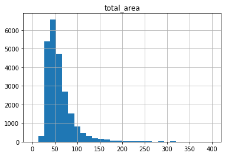


<div style="border:solid orange 2px; padding: 20px"> <h1 style="color:orange; margin-bottom:20px">Комментарий наставника</h1>

Не забывай подписывать оси на графиках и сам график, иначе не залазя в код абсолютно не понятно, что изображено

Заметно что основная масса квартир площадью ~ 50 квм растёт к этому показателю, далее стремительно падает


```python
data = data.query('total_area <= 250')
```


```python
data.hist('rooms', bins=5, range=(0, 8 ) )
data['rooms'].describe()
```


    count    23483.000000
    mean         2.051825
    std          1.029584
    min          0.000000
    25%          1.000000
    50%          2.000000
    75%          3.000000
    max         14.000000
    Name: rooms, dtype: float64


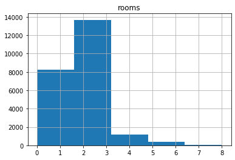


Больше всего было продано  2х 3х комнатных квартир


```python
 data = data.query('rooms <= 7')
```

Отсечем редкие продажи квартир свыше 7 комнат, их очень мало на общий результат это никак не повлияет


```python
data.hist('ceiling_height', bins=50, range=(0, 6)  )
data['ceiling_height'].describe()
```


    count    23468.000000
    mean         2.705912
    std          0.226923
    min          2.500000
    25%          2.550000
    50%          2.650000
    75%          2.750000
    max          5.800000
    Name: ceiling_height, dtype: float64


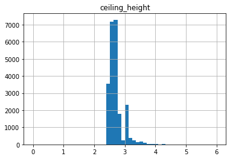


```python
data =  data.query('ceiling_height <= 4')
```


```python
data.hist('last_price', bins=40, range=(2000000, 20000000 ) )
```


    array([[<matplotlib.axes._subplots.AxesSubplot object at 0x7f5d16f414d0>]],
          dtype=object)


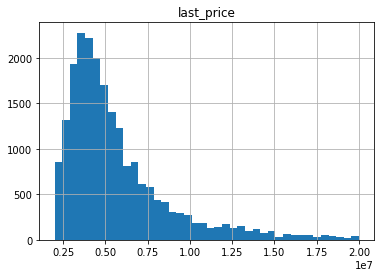


```python
data.hist('days_exposition', bins=100)
sale_mean = data['days_exposition'].mean().round()
sale_median = data['days_exposition'].median().round()

print ('Среднее время продажи квартир', sale_mean )
print ('Медиана времени продажи квартир', sale_median )
```

    Среднее время продажи квартир 156.0
    Медиана времени продажи квартир 73.0


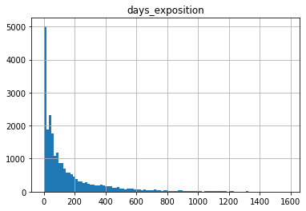


Исходя из данных медиана сильно отличается от среднего, полагаясь на это можно сказать что есть случаи когда продажа длилась особенно долго! на гистограмме видно что были случаи когда жилье продовалось > 1200 дней

Так же есть случаи очень быстро продажи за несколько дней, похоже на мошеннические действия, таким образом было принято решение отсечь датафрейм по продаже (5-600) дней

<div style="border:solid  green  2px; padding: 20px"> <h1 style="color: green ; margin-bottom:20px">Комментарий наставника</h1>

Всё абсолютно верно, радует,что пишешь такие подробные и всепокрывающие выводы


```python
data = data.query(' 5 < days_exposition < 600')
```

отсечем все продажи свыше 600 дней (слишком долгий период, еденичные продажи) а так же до 5 дней, так как большой пик! владельцы могли снимать объявления и выкладывать заново, чтоб поднять объявление наверх


```python
data = data[data['ceiling_height']  < 6]
```


```python
data.plot(x='last_price', y='total_area', kind='scatter', alpha=0.3)

```


    <matplotlib.axes._subplots.AxesSubplot at 0x7f5d16d1c310>


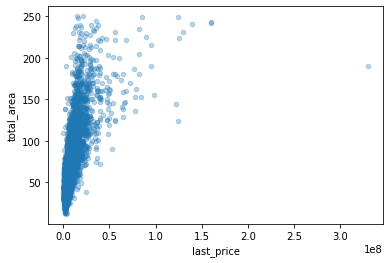


Заметно что с увелечнием площади, цена квартиры увеличивается


```python
data.plot(x='last_price', y='rooms', kind='scatter', alpha=0.3)

```


    <matplotlib.axes._subplots.AxesSubplot at 0x7f5d16c84d50>


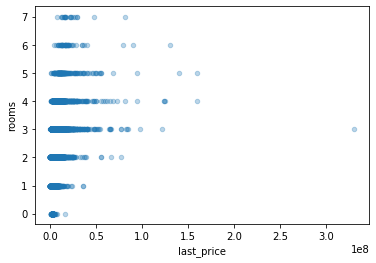


Цены на квартиры растут в зависимости от кол-ва комнат (до 4 )  далее цена уменьшается, это скорее всего связано с тем что в Петербурге много бывших коммунальных квартир переведенных в обычные  


```python
data.plot(x='cityCenters_nearest', y='last_price', kind='scatter', alpha=0.3)


```


    <matplotlib.axes._subplots.AxesSubplot at 0x7f5d1339d990>


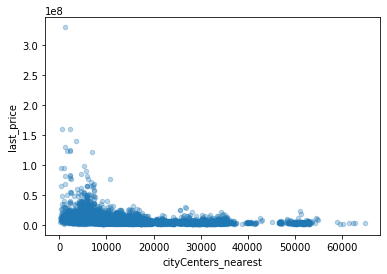


На мой взгляд удаленность от центра не сильно влияет на стоимость жилья


```python
data.plot(x='last_price', y='weekday', kind='scatter', alpha=0.3)

```


    <matplotlib.axes._subplots.AxesSubplot at 0x7f5d1338be50>


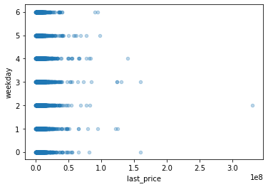


Явной зависимости дня сделки и цены не наблюдается, только в воскресенье более лешевые сделки 


```python
data.plot(x='last_price', y='month', kind='scatter', alpha=0.3)

```


    <matplotlib.axes._subplots.AxesSubplot at 0x7f5d132feed0>


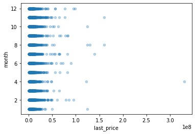


Сделки с более дорогим жильем своершаются в июне и ноябре. Июнь многие получают квартальные и полугодовые премии, ноябрь - предновогодние скидки, и так же люди старабтся закрыть сделку в уходящем году


```python
data.plot(x='last_price', y='year', kind='scatter', alpha=0.3)

```


    <matplotlib.axes._subplots.AxesSubplot at 0x7f5d132d5510>


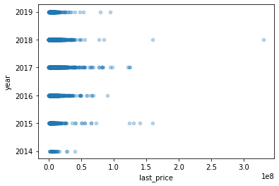


Цены на квартиры до 2017 года росли, далее наблюдается спад в цене! это можно увязать с ценой курса доллара


```python
data.plot(x='last_price', y='floor', kind='scatter', alpha=0.3)

```


    <matplotlib.axes._subplots.AxesSubplot at 0x7f5d16d41b90>


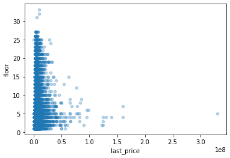


Зависимости этажа и цены не наблюдается


```python
sale = data.pivot_table(index='locality_name', values='sqmprice', aggfunc=['mean', 'count'])
```


```python
sale.columns = ('sqmprice', 'count')
```


```python
sale['sqmprice'] = sale['sqmprice'].round()
sale.sort_values(by='count', ascending=False).head(10)
```


<div>
<style scoped>
    .dataframe tbody tr th:only-of-type {
        vertical-align: middle;
    }

    .dataframe tbody tr th {
        vertical-align: top;
    }

    .dataframe thead th {
        text-align: right;
    }
</style>
<table border="1" class="dataframe">
  <thead>
    <tr style="text-align: right;">
      <th></th>
      <th>sqmprice</th>
      <th>count</th>
    </tr>
    <tr>
      <th>locality_name</th>
      <th></th>
      <th></th>
    </tr>
  </thead>
  <tbody>
    <tr>
      <td>Санкт-Петербург</td>
      <td>110959.0</td>
      <td>12303</td>
    </tr>
    <tr>
      <td>посёлок Мурино</td>
      <td>85879.0</td>
      <td>480</td>
    </tr>
    <tr>
      <td>посёлок Шушары</td>
      <td>78025.0</td>
      <td>387</td>
    </tr>
    <tr>
      <td>Всеволожск</td>
      <td>68706.0</td>
      <td>310</td>
    </tr>
    <tr>
      <td>Колпино</td>
      <td>74581.0</td>
      <td>287</td>
    </tr>
    <tr>
      <td>посёлок Парголово</td>
      <td>89259.0</td>
      <td>284</td>
    </tr>
    <tr>
      <td>Пушкин</td>
      <td>101278.0</td>
      <td>273</td>
    </tr>
    <tr>
      <td>деревня Кудрово</td>
      <td>92571.0</td>
      <td>269</td>
    </tr>
    <tr>
      <td>Гатчина</td>
      <td>68110.0</td>
      <td>241</td>
    </tr>
    <tr>
      <td>Выборг</td>
      <td>57093.0</td>
      <td>189</td>
    </tr>
  </tbody>
</table>
</div>


Среди 10 городов с наибольшим числом сделок, можно выделить СПб где средняя цена за квм жилья выше всего, замыкает рейтинг Выборг там самое доступное жилье в пересчете на квм

<div style="border:solid  green  2px; padding: 20px"> <h1 style="color: green ; margin-bottom:20px">Комментарий наставника</h1>

Верно


```python
spb = data.query('locality_name == "Санкт-Петербург"')
```


```python
spb.dropna(subset=['cityCenters_nearest'], inplace=True)
```

    /opt/conda/lib/python3.7/site-packages/ipykernel_launcher.py:1: SettingWithCopyWarning: 
    A value is trying to be set on a copy of a slice from a DataFrame
    
    See the caveats in the documentation: http://pandas.pydata.org/pandas-docs/stable/user_guide/indexing.html#returning-a-view-versus-a-copy
      """Entry point for launching an IPython kernel.


```python
spb.head()
```


<div>
<style scoped>
    .dataframe tbody tr th:only-of-type {
        vertical-align: middle;
    }

    .dataframe tbody tr th {
        vertical-align: top;
    }

    .dataframe thead th {
        text-align: right;
    }
</style>
<table border="1" class="dataframe">
  <thead>
    <tr style="text-align: right;">
      <th></th>
      <th>total_images</th>
      <th>last_price</th>
      <th>total_area</th>
      <th>first_day_exposition</th>
      <th>rooms</th>
      <th>ceiling_height</th>
      <th>floors_total</th>
      <th>living_area</th>
      <th>floor</th>
      <th>is_apartment</th>
      <th>...</th>
      <th>ponds_around3000</th>
      <th>ponds_nearest</th>
      <th>days_exposition</th>
      <th>sqmprice</th>
      <th>weekday</th>
      <th>year</th>
      <th>month</th>
      <th>floor_name</th>
      <th>livingtotal</th>
      <th>kitchentotal</th>
    </tr>
  </thead>
  <tbody>
    <tr>
      <td>2</td>
      <td>10</td>
      <td>5196000</td>
      <td>56.0</td>
      <td>2015-08-20</td>
      <td>2</td>
      <td>2.55</td>
      <td>5</td>
      <td>34.3</td>
      <td>4</td>
      <td>False</td>
      <td>...</td>
      <td>2</td>
      <td>574.0</td>
      <td>558.0</td>
      <td>92786.0</td>
      <td>3</td>
      <td>2015</td>
      <td>8</td>
      <td>Другое</td>
      <td>0.612500</td>
      <td>0.148214</td>
    </tr>
    <tr>
      <td>3</td>
      <td>0</td>
      <td>64900000</td>
      <td>159.0</td>
      <td>2015-07-24</td>
      <td>3</td>
      <td>2.60</td>
      <td>14</td>
      <td>95.0</td>
      <td>9</td>
      <td>False</td>
      <td>...</td>
      <td>3</td>
      <td>234.0</td>
      <td>424.0</td>
      <td>408176.0</td>
      <td>4</td>
      <td>2015</td>
      <td>7</td>
      <td>Другое</td>
      <td>0.597484</td>
      <td>0.103774</td>
    </tr>
    <tr>
      <td>4</td>
      <td>2</td>
      <td>10000000</td>
      <td>100.0</td>
      <td>2018-06-19</td>
      <td>2</td>
      <td>3.03</td>
      <td>14</td>
      <td>32.0</td>
      <td>13</td>
      <td>False</td>
      <td>...</td>
      <td>1</td>
      <td>48.0</td>
      <td>121.0</td>
      <td>100000.0</td>
      <td>1</td>
      <td>2018</td>
      <td>6</td>
      <td>Другое</td>
      <td>0.320000</td>
      <td>0.410000</td>
    </tr>
    <tr>
      <td>9</td>
      <td>18</td>
      <td>5400000</td>
      <td>61.0</td>
      <td>2017-02-26</td>
      <td>3</td>
      <td>2.50</td>
      <td>9</td>
      <td>43.6</td>
      <td>7</td>
      <td>False</td>
      <td>...</td>
      <td>0</td>
      <td>NaN</td>
      <td>289.0</td>
      <td>88525.0</td>
      <td>6</td>
      <td>2017</td>
      <td>2</td>
      <td>Другое</td>
      <td>0.714754</td>
      <td>0.106557</td>
    </tr>
    <tr>
      <td>10</td>
      <td>5</td>
      <td>5050000</td>
      <td>39.6</td>
      <td>2017-11-16</td>
      <td>1</td>
      <td>2.67</td>
      <td>12</td>
      <td>20.3</td>
      <td>3</td>
      <td>False</td>
      <td>...</td>
      <td>2</td>
      <td>553.0</td>
      <td>137.0</td>
      <td>127525.0</td>
      <td>3</td>
      <td>2017</td>
      <td>11</td>
      <td>Другое</td>
      <td>0.512626</td>
      <td>0.214646</td>
    </tr>
  </tbody>
</table>
<p>5 rows × 29 columns</p>
</div>


```python
spb['km'] = spb['cityCenters_nearest'] /1000
spb['km'] = spb['km'].round()
```

    /opt/conda/lib/python3.7/site-packages/ipykernel_launcher.py:1: SettingWithCopyWarning: 
    A value is trying to be set on a copy of a slice from a DataFrame.
    Try using .loc[row_indexer,col_indexer] = value instead
    
    See the caveats in the documentation: http://pandas.pydata.org/pandas-docs/stable/user_guide/indexing.html#returning-a-view-versus-a-copy
      """Entry point for launching an IPython kernel.
    /opt/conda/lib/python3.7/site-packages/ipykernel_launcher.py:2: SettingWithCopyWarning: 
    A value is trying to be set on a copy of a slice from a DataFrame.
    Try using .loc[row_indexer,col_indexer] = value instead
    
    See the caveats in the documentation: http://pandas.pydata.org/pandas-docs/stable/user_guide/indexing.html#returning-a-view-versus-a-copy
      


```python
spb.head()
```


<div>
<style scoped>
    .dataframe tbody tr th:only-of-type {
        vertical-align: middle;
    }

    .dataframe tbody tr th {
        vertical-align: top;
    }

    .dataframe thead th {
        text-align: right;
    }
</style>
<table border="1" class="dataframe">
  <thead>
    <tr style="text-align: right;">
      <th></th>
      <th>total_images</th>
      <th>last_price</th>
      <th>total_area</th>
      <th>first_day_exposition</th>
      <th>rooms</th>
      <th>ceiling_height</th>
      <th>floors_total</th>
      <th>living_area</th>
      <th>floor</th>
      <th>is_apartment</th>
      <th>...</th>
      <th>ponds_nearest</th>
      <th>days_exposition</th>
      <th>sqmprice</th>
      <th>weekday</th>
      <th>year</th>
      <th>month</th>
      <th>floor_name</th>
      <th>livingtotal</th>
      <th>kitchentotal</th>
      <th>km</th>
    </tr>
  </thead>
  <tbody>
    <tr>
      <td>2</td>
      <td>10</td>
      <td>5196000</td>
      <td>56.0</td>
      <td>2015-08-20</td>
      <td>2</td>
      <td>2.55</td>
      <td>5</td>
      <td>34.3</td>
      <td>4</td>
      <td>False</td>
      <td>...</td>
      <td>574.0</td>
      <td>558.0</td>
      <td>92786.0</td>
      <td>3</td>
      <td>2015</td>
      <td>8</td>
      <td>Другое</td>
      <td>0.612500</td>
      <td>0.148214</td>
      <td>14.0</td>
    </tr>
    <tr>
      <td>3</td>
      <td>0</td>
      <td>64900000</td>
      <td>159.0</td>
      <td>2015-07-24</td>
      <td>3</td>
      <td>2.60</td>
      <td>14</td>
      <td>95.0</td>
      <td>9</td>
      <td>False</td>
      <td>...</td>
      <td>234.0</td>
      <td>424.0</td>
      <td>408176.0</td>
      <td>4</td>
      <td>2015</td>
      <td>7</td>
      <td>Другое</td>
      <td>0.597484</td>
      <td>0.103774</td>
      <td>7.0</td>
    </tr>
    <tr>
      <td>4</td>
      <td>2</td>
      <td>10000000</td>
      <td>100.0</td>
      <td>2018-06-19</td>
      <td>2</td>
      <td>3.03</td>
      <td>14</td>
      <td>32.0</td>
      <td>13</td>
      <td>False</td>
      <td>...</td>
      <td>48.0</td>
      <td>121.0</td>
      <td>100000.0</td>
      <td>1</td>
      <td>2018</td>
      <td>6</td>
      <td>Другое</td>
      <td>0.320000</td>
      <td>0.410000</td>
      <td>8.0</td>
    </tr>
    <tr>
      <td>9</td>
      <td>18</td>
      <td>5400000</td>
      <td>61.0</td>
      <td>2017-02-26</td>
      <td>3</td>
      <td>2.50</td>
      <td>9</td>
      <td>43.6</td>
      <td>7</td>
      <td>False</td>
      <td>...</td>
      <td>NaN</td>
      <td>289.0</td>
      <td>88525.0</td>
      <td>6</td>
      <td>2017</td>
      <td>2</td>
      <td>Другое</td>
      <td>0.714754</td>
      <td>0.106557</td>
      <td>15.0</td>
    </tr>
    <tr>
      <td>10</td>
      <td>5</td>
      <td>5050000</td>
      <td>39.6</td>
      <td>2017-11-16</td>
      <td>1</td>
      <td>2.67</td>
      <td>12</td>
      <td>20.3</td>
      <td>3</td>
      <td>False</td>
      <td>...</td>
      <td>553.0</td>
      <td>137.0</td>
      <td>127525.0</td>
      <td>3</td>
      <td>2017</td>
      <td>11</td>
      <td>Другое</td>
      <td>0.512626</td>
      <td>0.214646</td>
      <td>14.0</td>
    </tr>
  </tbody>
</table>
<p>5 rows × 30 columns</p>
</div>


```python
spb1 = spb.pivot_table(index = 'km', values='last_price')
```


```python
spb1.info()
```

    <class 'pandas.core.frame.DataFrame'>
    Float64Index: 30 entries, 0.0 to 29.0
    Data columns (total 1 columns):
    last_price    30 non-null float64
    dtypes: float64(1)
    memory usage: 480.0 bytes


```python
spb1.plot( style='o-', grid=True, figsize=(12, 6))
```


    <matplotlib.axes._subplots.AxesSubplot at 0x7f5d16f67310>


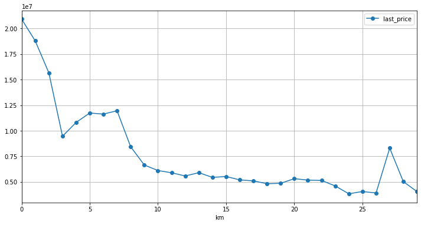


Судя по графику можно наблюдать что скачок начинается от 3 км, так что можно предположить что 3 км это граница центальной зоны Петербурга


```python
spb_center = spb.query('km <= 3')
```

<div style="border:solid  green  2px; padding: 20px"> <h1 style="color: green ; margin-bottom:20px">Комментарий наставника</h1>

Центр определён верно, класс!


```python
spb_center.hist('total_area', bins=30, range= (0, 400))
spb_center['total_area'].describe()
```


    count    584.000000
    mean      90.150873
    std       42.271494
    min       12.000000
    25%       60.800000
    50%       82.000000
    75%      108.200000
    max      248.700000
    Name: total_area, dtype: float64


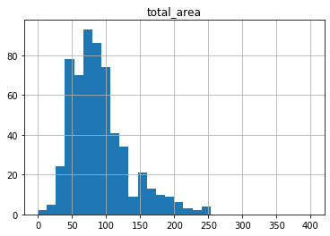


```python
spb_center.hist('last_price', bins=40, range=(2000000, 20000000 ) )
spb_center['last_price'].describe()
```


    count    5.840000e+02
    mean     1.395167e+07
    std      2.151663e+07
    min      2.385000e+06
    25%      6.800000e+06
    50%      9.000000e+06
    75%      1.349925e+07
    max      3.300000e+08
    Name: last_price, dtype: float64


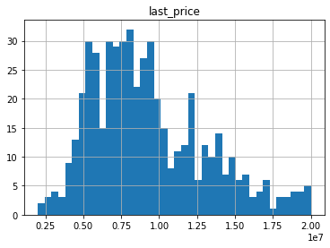


```python
spb_center.hist('rooms', bins=5, range=(0, 8 ) )
spb_center['rooms'].describe()
```


    count    584.000000
    mean       2.952055
    std        1.279645
    min        0.000000
    25%        2.000000
    50%        3.000000
    75%        4.000000
    max        7.000000
    Name: rooms, dtype: float64


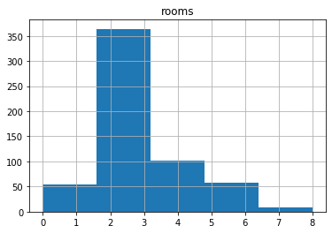


```python
spb_center.hist('ceiling_height', bins=50, range=(0, 6)  )
spb_center['ceiling_height'].describe()
```


    count    584.000000
    mean       3.038168
    std        0.344694
    min        2.500000
    25%        2.800000
    50%        3.000000
    75%        3.260000
    max        4.000000
    Name: ceiling_height, dtype: float64


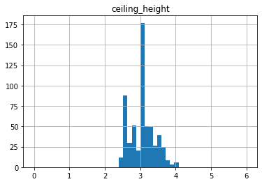


```python
spb_center.plot(x='total_area', y='last_price', kind='scatter', alpha=0.3)
```


    <matplotlib.axes._subplots.AxesSubplot at 0x7f5d131d7650>


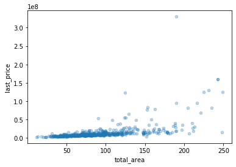


```python
spb_center.plot(x='last_price', y='rooms', kind='scatter', alpha=0.3)
```


    <matplotlib.axes._subplots.AxesSubplot at 0x7f5d13000f50>


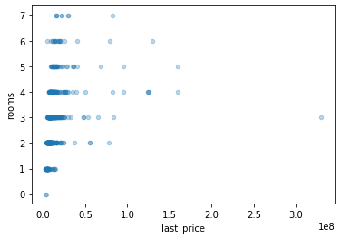


```python
spb_center.plot(x='floor', y='last_price', kind='scatter', alpha=0.3)
```


    <matplotlib.axes._subplots.AxesSubplot at 0x7f5d130b5450>


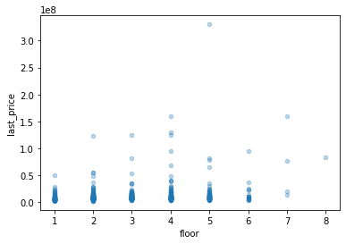


```python
spb_center.plot(x='km', y='last_price', kind='scatter', alpha=0.3)
```


    <matplotlib.axes._subplots.AxesSubplot at 0x7f5d13160f50>


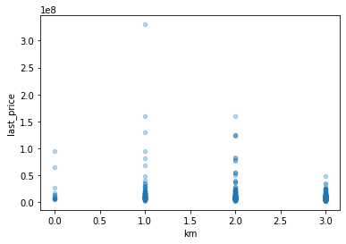


```python
spb_center.plot(x='last_price', y='year', kind='scatter', alpha=0.3)
```


    <matplotlib.axes._subplots.AxesSubplot at 0x7f5d16da9690>


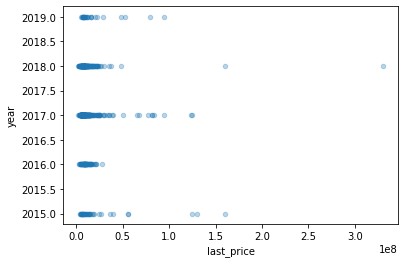


```python

```

Высота потолков в центре выше чем в обшей выборке, концетрация квартир с площадью 70-100 квм в центре преобладает, а в общей выборке ~ 55 квм.  люди готовы платить за жилье  в центре выше чем в целом за его пределами. кол-во комнат продаваемых объектов в центре и по региону не отличается. Цена в центре не имеет отличий в зависимости от числа комнат, этажа,  даты размещения объявления! а удаленность от центра в (центральном районе ) не наблюдается, в отличии от всей выборки 


<div style="border:solid  green  2px; padding: 20px"> <h1 style="color: green ; margin-bottom:20px">Комментарий наставника</h1>

У тебя отлично получается анализировать сложные данные и находить скрытые зависимости, здорово!)

### Шаг 5. Общий вывод

Основная доля продаж приходится на 2х 3х комнатные квартиры, стоимостью в пределах 5000000, цена росла до 2017 года, далее плавно снижалась! В центре нет зависимости удаленности от него и стоимости квартиры. Пики продаж приходятся на ноябрь и июнь месяц (связано с полугодовыми премиями и квартальными) а так же желаением людей закрыть сделку в уходящем году. в центре квартиры приобладают с более высокими потолками и малоэтажностью  (старые дома) а целом по выборке наоборот более высокие дома и стандартрые потолки 2.8

Центр ограничивается 3 км. На стоимость квартир центре влияет площадь и более высокая стоимость за квм, более дорогие квартиры расположены на 2ом км

<div style="border:solid orange 2px; padding: 20px"> <h1 style="color:orange; margin-bottom:20px">Комментарий наставника</h1>

Общий вывод в будущем стоит писать подробнее, а так же приводить больше цифр полученных в ходе выполнения проекта


### Чек-лист готовности проекта

Поставьте 'x' в выполненных пунктах. Далее нажмите Shift+Enter.

- [x]  открыт файл
- [x]  файлы изучены (выведены первые строки, метод info())
- [x]  определены пропущенные значения
- [x]  заполнены пропущенные значения
- [x]  есть пояснение какие пропущенные значения обнаружены
- [x]  изменены типы данных
- [x]  есть пояснение в каких столбцах изменены типы и почему
- [x]  посчитано и добавлено в таблицу: цена квадратного метра
- [x]  посчитано и добавлено в таблицу: день недели, месяц и год публикации объявления
- [x]  посчитано и добавлено в таблицу: этаж квартиры; варианты — первый, последний, другой
- [x]  посчитано и добавлено в таблицу: соотношение жилой и общей площади, а также отношение площади кухни к общей
- [x]  изучены следующие параметры: площадь, цена, число комнат, высота потолков
- [x]  построены гистограммы для каждого параметра
- [x]  выполнено задание: "Изучите время продажи квартиры. Постройте гистограмму. Посчитайте среднее и медиану. Опишите, сколько обычно занимает продажа. Когда можно считать, что продажи прошли очень быстро, а когда необычно долго?"
- [x]  выполнено задание: "Уберите редкие и выбивающиеся значения. Опишите, какие особенности обнаружили."
- [x]  выполнено задание: "Какие факторы больше всего влияют на стоимость квартиры? Изучите, зависит ли цена от квадратного метра, числа комнат, этажа (первого или последнего), удалённости от центра. Также изучите зависимость от даты размещения: дня недели, месяца и года. "Выберите 10 населённых пунктов с наибольшим числом объявлений. Посчитайте среднюю цену квадратного метра в этих населённых пунктах. Выделите населённые пункты с самой высокой и низкой стоимостью жилья. Эти данные можно найти по имени в столбце '*locality_name'*. "
- [x]  выполнено задание: "Изучите предложения квартир: для каждой квартиры есть информация о расстоянии до центра. Выделите квартиры в Санкт-Петербурге (*'locality_name'*). Ваша задача — выяснить, какая область входит в центр. Создайте столбец с расстоянием до центра в километрах: округлите до целых значений. После этого посчитайте среднюю цену для каждого километра. Постройте график: он должен показывать, как цена зависит от удалённости от центра. Определите границу, где график сильно меняется — это и будет центральная зона. "
- [x]  выполнено задание: "Выделите сегмент квартир в центре. Проанализируйте эту территорию и изучите следующие параметры: площадь, цена, число комнат, высота потолков. Также выделите факторы, которые влияют на стоимость квартиры (число комнат, этаж, удалённость от центра, дата размещения объявления). Сделайте выводы. Отличаются ли они от общих выводов по всему городу?"
- [x]  в каждом этапе есть выводы
- [x]  есть общий вывод

<div style="border:solid  green  2px; padding: 20px">

<h1 style="color: green ; margin-bottom:20px">Комментарий наставника</h1>

#### Код

Всё отлично. Из того, что очень порадовало - соблюдена структура проекта, шаги из задания обозначены и выполнены последовательно, код написан аккуратно, используются комментарии к коду, быстро можно понять, какие операции выполняют сложные конструкции. В качестве совета предлагаю глубже изучить библиотеку Seaborn для построения более ярких и качественных визуализаций в Python, так как иногда хорошая красочная визуализация может сказать очень многое о данных.

#### Выводы

Ты пишешь отличные обоснованные выводы по проделанной раблоте и выдвигаешь корректные гипотезы - это очень радует!) Так же видно глубокое понимание проведённого анализа. Было очень интересно проверять твой проект и следить за твоей мыслью, продолжай в том же духе) Удачи!)

<div style="border:solid  green  2px; padding: 20px">

<h1 style="color: green ; margin-bottom:20px">Комментарий наставника</h1>

Работа принята!) Удачи на следующих этапах, у тебя всё получится, только не сомневайся в себе и старательно подходи ко всем вопросам)


```python

```
