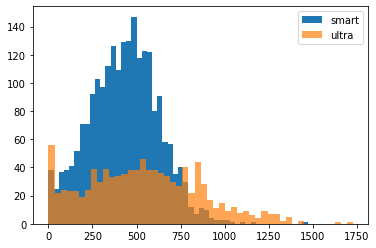
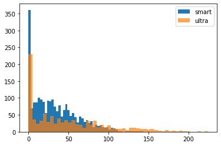
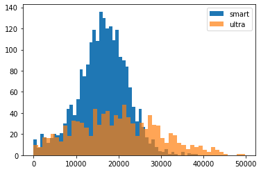

<div style="border:solid green 2px; padding: 20px"> <h1 style="color:green; margin-bottom:20px">Комментарий наставника</h1>

Привет! Спасибо, что сдал задание:) Ты проделал большую работу. Далее в файле мои комментарии ты сможешь найти в ячейках, аналогичных данной ( если рамки комментария зелёные - всё сделано правильно; жёлтые - есть замечания, но не критично; красные - нужно переделать). Не удаляй эти комментарии и постарайся учесть их в ходе выполнения проекта. 

</div>

# Шаг 1. Откройте файл с данными и изучите общую информацию


<div style="border:solid  orange  2px; padding: 20px"> <h1 style="color: orange ; margin-bottom:20px">Комментарий наставника</h1>

Надо обязательно прикреплять описание проекта, иначе не понятно в чём суть вообще твоей работы


```python
import numpy as np
import pandas as pd
import matplotlib.pyplot as plt
from scipy import stats as st
```


```python
calls = pd.read_csv('/datasets/calls.csv')
internet = pd.read_csv('/datasets/internet.csv')
messages = pd.read_csv('/datasets/messages.csv')
tariffs = pd.read_csv('/datasets/tariffs.csv')
users = pd.read_csv('/datasets/users.csv')
```


```python
tariffs.info()

```

    <class 'pandas.core.frame.DataFrame'>
    RangeIndex: 2 entries, 0 to 1
    Data columns (total 8 columns):
    messages_included        2 non-null int64
    mb_per_month_included    2 non-null int64
    minutes_included         2 non-null int64
    rub_monthly_fee          2 non-null int64
    rub_per_gb               2 non-null int64
    rub_per_message          2 non-null int64
    rub_per_minute           2 non-null int64
    tariff_name              2 non-null object
    dtypes: int64(7), object(1)
    memory usage: 256.0+ bytes


- tariff_name — название тарифа
- rub_monthly_fee — ежемесячная абонентская плата в рублях
- minutes_included — количество минут разговора в месяц, включённых в абонентскую плату
- messages_included — количество сообщений в месяц, включённых в абонентскую плату
- mb_per_month_included — объём интернет-трафика, включённого в абонентскую плату (в мегабайтах)
- rub_per_minute — стоимость минуты разговора сверх тарифного пакета (например, если в тарифе 100 минут разговора в месяц, то со 101 минуты будет взиматься плата)
- rub_per_message — стоимость отправки сообщения сверх тарифного пакета
- rub_per_gb — стоимость дополнительного гигабайта интернет-трафика сверх тарифного пакета (1 гигабайт = 1024 мегабайта)


```python

    #Сразу же переименуем колонку с названием тарифа, чтобы в дальнейшем у нас была возможность применить merge по ней.
    

tariffs = tariffs.rename(columns={'tariff_name': 'tariff'})
```


```python
tariffs

```


<div>
<style scoped>
    .dataframe tbody tr th:only-of-type {
        vertical-align: middle;
    }

    .dataframe tbody tr th {
        vertical-align: top;
    }

    .dataframe thead th {
        text-align: right;
    }
</style>
<table border="1" class="dataframe">
  <thead>
    <tr style="text-align: right;">
      <th></th>
      <th>messages_included</th>
      <th>mb_per_month_included</th>
      <th>minutes_included</th>
      <th>rub_monthly_fee</th>
      <th>rub_per_gb</th>
      <th>rub_per_message</th>
      <th>rub_per_minute</th>
      <th>tariff</th>
    </tr>
  </thead>
  <tbody>
    <tr>
      <td>0</td>
      <td>50</td>
      <td>15360</td>
      <td>500</td>
      <td>550</td>
      <td>200</td>
      <td>3</td>
      <td>3</td>
      <td>smart</td>
    </tr>
    <tr>
      <td>1</td>
      <td>1000</td>
      <td>30720</td>
      <td>3000</td>
      <td>1950</td>
      <td>150</td>
      <td>1</td>
      <td>1</td>
      <td>ultra</td>
    </tr>
  </tbody>
</table>
</div>


```python
users.info()

```

    <class 'pandas.core.frame.DataFrame'>
    RangeIndex: 500 entries, 0 to 499
    Data columns (total 8 columns):
    user_id       500 non-null int64
    age           500 non-null int64
    churn_date    38 non-null object
    city          500 non-null object
    first_name    500 non-null object
    last_name     500 non-null object
    reg_date      500 non-null object
    tariff        500 non-null object
    dtypes: int64(2), object(6)
    memory usage: 31.4+ KB


- user_id — уникальный идентификатор пользователя
- first_name — имя пользователя
- last_name — фамилия пользователя
- age — возраст пользователя (годы)
- reg_date — дата подключения тарифа (день, месяц, год)
- churn_date — дата прекращения пользования тарифом (если значение пропущено, то тариф ещё действовал на момент выгрузки данных)
- city — город проживания пользователя
- tariff — название тарифного плана


```python
users
```


<div>
<style scoped>
    .dataframe tbody tr th:only-of-type {
        vertical-align: middle;
    }

    .dataframe tbody tr th {
        vertical-align: top;
    }

    .dataframe thead th {
        text-align: right;
    }
</style>
<table border="1" class="dataframe">
  <thead>
    <tr style="text-align: right;">
      <th></th>
      <th>user_id</th>
      <th>age</th>
      <th>churn_date</th>
      <th>city</th>
      <th>first_name</th>
      <th>last_name</th>
      <th>reg_date</th>
      <th>tariff</th>
    </tr>
  </thead>
  <tbody>
    <tr>
      <td>0</td>
      <td>1000</td>
      <td>52</td>
      <td>NaN</td>
      <td>Краснодар</td>
      <td>Рафаил</td>
      <td>Верещагин</td>
      <td>2018-05-25</td>
      <td>ultra</td>
    </tr>
    <tr>
      <td>1</td>
      <td>1001</td>
      <td>41</td>
      <td>NaN</td>
      <td>Москва</td>
      <td>Иван</td>
      <td>Ежов</td>
      <td>2018-11-01</td>
      <td>smart</td>
    </tr>
    <tr>
      <td>2</td>
      <td>1002</td>
      <td>59</td>
      <td>NaN</td>
      <td>Стерлитамак</td>
      <td>Евгений</td>
      <td>Абрамович</td>
      <td>2018-06-17</td>
      <td>smart</td>
    </tr>
    <tr>
      <td>3</td>
      <td>1003</td>
      <td>23</td>
      <td>NaN</td>
      <td>Москва</td>
      <td>Белла</td>
      <td>Белякова</td>
      <td>2018-08-17</td>
      <td>ultra</td>
    </tr>
    <tr>
      <td>4</td>
      <td>1004</td>
      <td>68</td>
      <td>NaN</td>
      <td>Новокузнецк</td>
      <td>Татьяна</td>
      <td>Авдеенко</td>
      <td>2018-05-14</td>
      <td>ultra</td>
    </tr>
    <tr>
      <td>...</td>
      <td>...</td>
      <td>...</td>
      <td>...</td>
      <td>...</td>
      <td>...</td>
      <td>...</td>
      <td>...</td>
      <td>...</td>
    </tr>
    <tr>
      <td>495</td>
      <td>1495</td>
      <td>65</td>
      <td>NaN</td>
      <td>Иркутск</td>
      <td>Авксентий</td>
      <td>Фокин</td>
      <td>2018-08-28</td>
      <td>ultra</td>
    </tr>
    <tr>
      <td>496</td>
      <td>1496</td>
      <td>36</td>
      <td>NaN</td>
      <td>Вологда</td>
      <td>Трифон</td>
      <td>Блохин</td>
      <td>2018-01-27</td>
      <td>smart</td>
    </tr>
    <tr>
      <td>497</td>
      <td>1497</td>
      <td>32</td>
      <td>NaN</td>
      <td>Челябинск</td>
      <td>Каролина</td>
      <td>Агеева</td>
      <td>2018-10-09</td>
      <td>smart</td>
    </tr>
    <tr>
      <td>498</td>
      <td>1498</td>
      <td>68</td>
      <td>2018-10-25</td>
      <td>Владикавказ</td>
      <td>Всеволод</td>
      <td>Акимчин</td>
      <td>2018-07-19</td>
      <td>smart</td>
    </tr>
    <tr>
      <td>499</td>
      <td>1499</td>
      <td>35</td>
      <td>NaN</td>
      <td>Пермь</td>
      <td>Гектор</td>
      <td>Корнилов</td>
      <td>2018-09-27</td>
      <td>smart</td>
    </tr>
  </tbody>
</table>
<p>500 rows × 8 columns</p>
</div>


```python
calls.info()

```

    <class 'pandas.core.frame.DataFrame'>
    RangeIndex: 202607 entries, 0 to 202606
    Data columns (total 4 columns):
    id           202607 non-null object
    call_date    202607 non-null object
    duration     202607 non-null float64
    user_id      202607 non-null int64
    dtypes: float64(1), int64(1), object(2)
    memory usage: 6.2+ MB


- id — уникальный номер звонка
- call_date — дата звонка
- duration — длительность звонка в минутах
- user_id — идентификатор пользователя, сделавшего звонок


```python
calls
```


<div>
<style scoped>
    .dataframe tbody tr th:only-of-type {
        vertical-align: middle;
    }

    .dataframe tbody tr th {
        vertical-align: top;
    }

    .dataframe thead th {
        text-align: right;
    }
</style>
<table border="1" class="dataframe">
  <thead>
    <tr style="text-align: right;">
      <th></th>
      <th>id</th>
      <th>call_date</th>
      <th>duration</th>
      <th>user_id</th>
    </tr>
  </thead>
  <tbody>
    <tr>
      <td>0</td>
      <td>1000_0</td>
      <td>2018-07-25</td>
      <td>0.00</td>
      <td>1000</td>
    </tr>
    <tr>
      <td>1</td>
      <td>1000_1</td>
      <td>2018-08-17</td>
      <td>0.00</td>
      <td>1000</td>
    </tr>
    <tr>
      <td>2</td>
      <td>1000_2</td>
      <td>2018-06-11</td>
      <td>2.85</td>
      <td>1000</td>
    </tr>
    <tr>
      <td>3</td>
      <td>1000_3</td>
      <td>2018-09-21</td>
      <td>13.80</td>
      <td>1000</td>
    </tr>
    <tr>
      <td>4</td>
      <td>1000_4</td>
      <td>2018-12-15</td>
      <td>5.18</td>
      <td>1000</td>
    </tr>
    <tr>
      <td>...</td>
      <td>...</td>
      <td>...</td>
      <td>...</td>
      <td>...</td>
    </tr>
    <tr>
      <td>202602</td>
      <td>1499_215</td>
      <td>2018-12-26</td>
      <td>0.76</td>
      <td>1499</td>
    </tr>
    <tr>
      <td>202603</td>
      <td>1499_216</td>
      <td>2018-10-18</td>
      <td>18.83</td>
      <td>1499</td>
    </tr>
    <tr>
      <td>202604</td>
      <td>1499_217</td>
      <td>2018-11-10</td>
      <td>10.81</td>
      <td>1499</td>
    </tr>
    <tr>
      <td>202605</td>
      <td>1499_218</td>
      <td>2018-10-06</td>
      <td>4.27</td>
      <td>1499</td>
    </tr>
    <tr>
      <td>202606</td>
      <td>1499_219</td>
      <td>2018-12-14</td>
      <td>19.62</td>
      <td>1499</td>
    </tr>
  </tbody>
</table>
<p>202607 rows × 4 columns</p>
</div>


```python
messages.info()

```

    <class 'pandas.core.frame.DataFrame'>
    RangeIndex: 123036 entries, 0 to 123035
    Data columns (total 3 columns):
    id              123036 non-null object
    message_date    123036 non-null object
    user_id         123036 non-null int64
    dtypes: int64(1), object(2)
    memory usage: 2.8+ MB


- id — уникальный номер сообщения
- message_date — дата сообщения
- user_id — идентификатор пользователя, отправившего сообщение


```python
messages
```


<div>
<style scoped>
    .dataframe tbody tr th:only-of-type {
        vertical-align: middle;
    }

    .dataframe tbody tr th {
        vertical-align: top;
    }

    .dataframe thead th {
        text-align: right;
    }
</style>
<table border="1" class="dataframe">
  <thead>
    <tr style="text-align: right;">
      <th></th>
      <th>id</th>
      <th>message_date</th>
      <th>user_id</th>
    </tr>
  </thead>
  <tbody>
    <tr>
      <td>0</td>
      <td>1000_0</td>
      <td>2018-06-27</td>
      <td>1000</td>
    </tr>
    <tr>
      <td>1</td>
      <td>1000_1</td>
      <td>2018-10-08</td>
      <td>1000</td>
    </tr>
    <tr>
      <td>2</td>
      <td>1000_2</td>
      <td>2018-08-04</td>
      <td>1000</td>
    </tr>
    <tr>
      <td>3</td>
      <td>1000_3</td>
      <td>2018-06-16</td>
      <td>1000</td>
    </tr>
    <tr>
      <td>4</td>
      <td>1000_4</td>
      <td>2018-12-05</td>
      <td>1000</td>
    </tr>
    <tr>
      <td>...</td>
      <td>...</td>
      <td>...</td>
      <td>...</td>
    </tr>
    <tr>
      <td>123031</td>
      <td>1499_179</td>
      <td>2018-12-12</td>
      <td>1499</td>
    </tr>
    <tr>
      <td>123032</td>
      <td>1499_180</td>
      <td>2018-09-28</td>
      <td>1499</td>
    </tr>
    <tr>
      <td>123033</td>
      <td>1499_181</td>
      <td>2018-09-27</td>
      <td>1499</td>
    </tr>
    <tr>
      <td>123034</td>
      <td>1499_182</td>
      <td>2018-11-15</td>
      <td>1499</td>
    </tr>
    <tr>
      <td>123035</td>
      <td>1499_183</td>
      <td>2018-11-16</td>
      <td>1499</td>
    </tr>
  </tbody>
</table>
<p>123036 rows × 3 columns</p>
</div>


```python
internet.info()

```

    <class 'pandas.core.frame.DataFrame'>
    RangeIndex: 149396 entries, 0 to 149395
    Data columns (total 5 columns):
    Unnamed: 0      149396 non-null int64
    id              149396 non-null object
    mb_used         149396 non-null float64
    session_date    149396 non-null object
    user_id         149396 non-null int64
    dtypes: float64(1), int64(2), object(2)
    memory usage: 5.7+ MB


- id — уникальный номер сессии
- mb_used — объём потраченного за сессию интернет-трафика (в мегабайтах)
- session_date — дата интернет-сессии
- user_id — идентификатор пользователя


```python
internet
```


<div>
<style scoped>
    .dataframe tbody tr th:only-of-type {
        vertical-align: middle;
    }

    .dataframe tbody tr th {
        vertical-align: top;
    }

    .dataframe thead th {
        text-align: right;
    }
</style>
<table border="1" class="dataframe">
  <thead>
    <tr style="text-align: right;">
      <th></th>
      <th>Unnamed: 0</th>
      <th>id</th>
      <th>mb_used</th>
      <th>session_date</th>
      <th>user_id</th>
    </tr>
  </thead>
  <tbody>
    <tr>
      <td>0</td>
      <td>0</td>
      <td>1000_0</td>
      <td>112.95</td>
      <td>2018-11-25</td>
      <td>1000</td>
    </tr>
    <tr>
      <td>1</td>
      <td>1</td>
      <td>1000_1</td>
      <td>1052.81</td>
      <td>2018-09-07</td>
      <td>1000</td>
    </tr>
    <tr>
      <td>2</td>
      <td>2</td>
      <td>1000_2</td>
      <td>1197.26</td>
      <td>2018-06-25</td>
      <td>1000</td>
    </tr>
    <tr>
      <td>3</td>
      <td>3</td>
      <td>1000_3</td>
      <td>550.27</td>
      <td>2018-08-22</td>
      <td>1000</td>
    </tr>
    <tr>
      <td>4</td>
      <td>4</td>
      <td>1000_4</td>
      <td>302.56</td>
      <td>2018-09-24</td>
      <td>1000</td>
    </tr>
    <tr>
      <td>...</td>
      <td>...</td>
      <td>...</td>
      <td>...</td>
      <td>...</td>
      <td>...</td>
    </tr>
    <tr>
      <td>149391</td>
      <td>149391</td>
      <td>1499_152</td>
      <td>318.90</td>
      <td>2018-10-03</td>
      <td>1499</td>
    </tr>
    <tr>
      <td>149392</td>
      <td>149392</td>
      <td>1499_153</td>
      <td>490.13</td>
      <td>2018-12-14</td>
      <td>1499</td>
    </tr>
    <tr>
      <td>149393</td>
      <td>149393</td>
      <td>1499_154</td>
      <td>0.00</td>
      <td>2018-10-27</td>
      <td>1499</td>
    </tr>
    <tr>
      <td>149394</td>
      <td>149394</td>
      <td>1499_155</td>
      <td>1246.32</td>
      <td>2018-11-26</td>
      <td>1499</td>
    </tr>
    <tr>
      <td>149395</td>
      <td>149395</td>
      <td>1499_156</td>
      <td>544.37</td>
      <td>2018-10-26</td>
      <td>1499</td>
    </tr>
  </tbody>
</table>
<p>149396 rows × 5 columns</p>
</div>


<div style="border:solid green 2px; padding: 20px"> <h1 style="color:green; margin-bottom:20px">Комментарий наставника</h1>

Молодец, что провёл первичный анализ полученных данных, это всегда быстро помогает понять с чем предстоит работать, по выводам нареканий нет - всё верно и точно
</div>

# Шаг 2. Подготовьте данные


```python
calls['duration'] = calls['duration'].apply(np.ceil)
NZ = calls['duration'] > 0
calls['duration'].where(NZ, 1, inplace=True)
```

 - применил метод np.ceil для признака, тем самым получив верхнее значение в минутах;
 - заменил нули на 1 – минимальное значение сессии звонка для оператора. (по хорошему нужно сходить к коллегам и уточнить что с выгрузкой)


```python
internet['mb_used'] = internet['mb_used'].apply(np.ceil)
NZI = internet['mb_used'] > 0
internet['mb_used'].where(NZI, 1, inplace=True)
```

- применим метод np.ceil для признака, тем самым получив верхнее значение в минутах;
- заменим нули на 1 – минимальное значение сессии.


```python
calls['call_date'] = pd.to_datetime(calls['call_date'], format='%Y-%m-%d')
users['reg_date'] = pd.to_datetime(users['reg_date'], format='%Y-%m-%d')
messages['message_date'] = pd.to_datetime(messages['message_date'], format='%Y-%m-%d')
internet['session_date'] = pd.to_datetime(internet['session_date'], format='%Y-%m-%d')

```

Преобразуем тип данных даты, чтоб в последующем извлечь месяц из даты


```python
calls['duration'] = calls['duration'].astype('int64')
internet['mb_used'] = internet['mb_used'].astype('int64')
```


```python
total = pd.DataFrame()
```

Создадим пустой ДатаФрейм


```python
calls['month'] = calls['call_date'].dt.month
```


```python
calls_by_month = calls.pivot_table(
    index=['month', 'user_id'],
    values='duration',
    aggfunc=['count', 'sum']
)
```


```python
calls_by_month
```


<div>
<style scoped>
    .dataframe tbody tr th:only-of-type {
        vertical-align: middle;
    }

    .dataframe tbody tr th {
        vertical-align: top;
    }

    .dataframe thead tr th {
        text-align: left;
    }

    .dataframe thead tr:last-of-type th {
        text-align: right;
    }
</style>
<table border="1" class="dataframe">
  <thead>
    <tr>
      <th></th>
      <th></th>
      <th>count</th>
      <th>sum</th>
    </tr>
    <tr>
      <th></th>
      <th></th>
      <th>duration</th>
      <th>duration</th>
    </tr>
    <tr>
      <th>month</th>
      <th>user_id</th>
      <th></th>
      <th></th>
    </tr>
  </thead>
  <tbody>
    <tr>
      <td rowspan="5" valign="top">1</td>
      <td>1005</td>
      <td>15</td>
      <td>99</td>
    </tr>
    <tr>
      <td>1032</td>
      <td>61</td>
      <td>397</td>
    </tr>
    <tr>
      <td>1045</td>
      <td>1</td>
      <td>9</td>
    </tr>
    <tr>
      <td>1055</td>
      <td>64</td>
      <td>568</td>
    </tr>
    <tr>
      <td>1071</td>
      <td>24</td>
      <td>200</td>
    </tr>
    <tr>
      <td>...</td>
      <td>...</td>
      <td>...</td>
      <td>...</td>
    </tr>
    <tr>
      <td rowspan="5" valign="top">12</td>
      <td>1494</td>
      <td>62</td>
      <td>426</td>
    </tr>
    <tr>
      <td>1495</td>
      <td>155</td>
      <td>1066</td>
    </tr>
    <tr>
      <td>1496</td>
      <td>80</td>
      <td>533</td>
    </tr>
    <tr>
      <td>1497</td>
      <td>71</td>
      <td>558</td>
    </tr>
    <tr>
      <td>1499</td>
      <td>69</td>
      <td>505</td>
    </tr>
  </tbody>
</table>
<p>3174 rows × 2 columns</p>
</div>


```python
tmp_df = pd.DataFrame(calls_by_month.to_records())

```


```python
total['user_id'] = tmp_df['user_id']
total['month']   = tmp_df['month']
total['calls']   = tmp_df.iloc[:, 2]
total['minutes'] = tmp_df.iloc[:, 3]
```


```python
total
```


<div>
<style scoped>
    .dataframe tbody tr th:only-of-type {
        vertical-align: middle;
    }

    .dataframe tbody tr th {
        vertical-align: top;
    }

    .dataframe thead th {
        text-align: right;
    }
</style>
<table border="1" class="dataframe">
  <thead>
    <tr style="text-align: right;">
      <th></th>
      <th>user_id</th>
      <th>month</th>
      <th>calls</th>
      <th>minutes</th>
    </tr>
  </thead>
  <tbody>
    <tr>
      <td>0</td>
      <td>1005</td>
      <td>1</td>
      <td>15</td>
      <td>99</td>
    </tr>
    <tr>
      <td>1</td>
      <td>1032</td>
      <td>1</td>
      <td>61</td>
      <td>397</td>
    </tr>
    <tr>
      <td>2</td>
      <td>1045</td>
      <td>1</td>
      <td>1</td>
      <td>9</td>
    </tr>
    <tr>
      <td>3</td>
      <td>1055</td>
      <td>1</td>
      <td>64</td>
      <td>568</td>
    </tr>
    <tr>
      <td>4</td>
      <td>1071</td>
      <td>1</td>
      <td>24</td>
      <td>200</td>
    </tr>
    <tr>
      <td>...</td>
      <td>...</td>
      <td>...</td>
      <td>...</td>
      <td>...</td>
    </tr>
    <tr>
      <td>3169</td>
      <td>1494</td>
      <td>12</td>
      <td>62</td>
      <td>426</td>
    </tr>
    <tr>
      <td>3170</td>
      <td>1495</td>
      <td>12</td>
      <td>155</td>
      <td>1066</td>
    </tr>
    <tr>
      <td>3171</td>
      <td>1496</td>
      <td>12</td>
      <td>80</td>
      <td>533</td>
    </tr>
    <tr>
      <td>3172</td>
      <td>1497</td>
      <td>12</td>
      <td>71</td>
      <td>558</td>
    </tr>
    <tr>
      <td>3173</td>
      <td>1499</td>
      <td>12</td>
      <td>69</td>
      <td>505</td>
    </tr>
  </tbody>
</table>
<p>3174 rows × 4 columns</p>
</div>


```python
messages['month'] = messages['message_date'].dt.month

```


```python
messages_by_month = messages.pivot_table(
    index=['month', 'user_id'],
    values='id',
    aggfunc='count'
)
```


```python
messages_by_month
```


<div>
<style scoped>
    .dataframe tbody tr th:only-of-type {
        vertical-align: middle;
    }

    .dataframe tbody tr th {
        vertical-align: top;
    }

    .dataframe thead th {
        text-align: right;
    }
</style>
<table border="1" class="dataframe">
  <thead>
    <tr style="text-align: right;">
      <th></th>
      <th></th>
      <th>id</th>
    </tr>
    <tr>
      <th>month</th>
      <th>user_id</th>
      <th></th>
    </tr>
  </thead>
  <tbody>
    <tr>
      <td rowspan="5" valign="top">1</td>
      <td>1005</td>
      <td>7</td>
    </tr>
    <tr>
      <td>1032</td>
      <td>38</td>
    </tr>
    <tr>
      <td>1045</td>
      <td>5</td>
    </tr>
    <tr>
      <td>1055</td>
      <td>30</td>
    </tr>
    <tr>
      <td>1071</td>
      <td>16</td>
    </tr>
    <tr>
      <td>...</td>
      <td>...</td>
      <td>...</td>
    </tr>
    <tr>
      <td rowspan="5" valign="top">12</td>
      <td>1493</td>
      <td>78</td>
    </tr>
    <tr>
      <td>1495</td>
      <td>84</td>
    </tr>
    <tr>
      <td>1496</td>
      <td>51</td>
    </tr>
    <tr>
      <td>1497</td>
      <td>17</td>
    </tr>
    <tr>
      <td>1499</td>
      <td>66</td>
    </tr>
  </tbody>
</table>
<p>2717 rows × 1 columns</p>
</div>


```python
tmp_df = pd.DataFrame(messages_by_month.to_records()).rename(columns={'id': 'messages'})

```


```python
tmp_df
```


<div>
<style scoped>
    .dataframe tbody tr th:only-of-type {
        vertical-align: middle;
    }

    .dataframe tbody tr th {
        vertical-align: top;
    }

    .dataframe thead th {
        text-align: right;
    }
</style>
<table border="1" class="dataframe">
  <thead>
    <tr style="text-align: right;">
      <th></th>
      <th>month</th>
      <th>user_id</th>
      <th>messages</th>
    </tr>
  </thead>
  <tbody>
    <tr>
      <td>0</td>
      <td>1</td>
      <td>1005</td>
      <td>7</td>
    </tr>
    <tr>
      <td>1</td>
      <td>1</td>
      <td>1032</td>
      <td>38</td>
    </tr>
    <tr>
      <td>2</td>
      <td>1</td>
      <td>1045</td>
      <td>5</td>
    </tr>
    <tr>
      <td>3</td>
      <td>1</td>
      <td>1055</td>
      <td>30</td>
    </tr>
    <tr>
      <td>4</td>
      <td>1</td>
      <td>1071</td>
      <td>16</td>
    </tr>
    <tr>
      <td>...</td>
      <td>...</td>
      <td>...</td>
      <td>...</td>
    </tr>
    <tr>
      <td>2712</td>
      <td>12</td>
      <td>1493</td>
      <td>78</td>
    </tr>
    <tr>
      <td>2713</td>
      <td>12</td>
      <td>1495</td>
      <td>84</td>
    </tr>
    <tr>
      <td>2714</td>
      <td>12</td>
      <td>1496</td>
      <td>51</td>
    </tr>
    <tr>
      <td>2715</td>
      <td>12</td>
      <td>1497</td>
      <td>17</td>
    </tr>
    <tr>
      <td>2716</td>
      <td>12</td>
      <td>1499</td>
      <td>66</td>
    </tr>
  </tbody>
</table>
<p>2717 rows × 3 columns</p>
</div>


```python
total = total.merge(tmp_df, on=['user_id', 'month'], how='outer')

```


```python
total
```


<div>
<style scoped>
    .dataframe tbody tr th:only-of-type {
        vertical-align: middle;
    }

    .dataframe tbody tr th {
        vertical-align: top;
    }

    .dataframe thead th {
        text-align: right;
    }
</style>
<table border="1" class="dataframe">
  <thead>
    <tr style="text-align: right;">
      <th></th>
      <th>user_id</th>
      <th>month</th>
      <th>calls</th>
      <th>minutes</th>
      <th>messages</th>
    </tr>
  </thead>
  <tbody>
    <tr>
      <td>0</td>
      <td>1005</td>
      <td>1</td>
      <td>15.0</td>
      <td>99.0</td>
      <td>7.0</td>
    </tr>
    <tr>
      <td>1</td>
      <td>1032</td>
      <td>1</td>
      <td>61.0</td>
      <td>397.0</td>
      <td>38.0</td>
    </tr>
    <tr>
      <td>2</td>
      <td>1045</td>
      <td>1</td>
      <td>1.0</td>
      <td>9.0</td>
      <td>5.0</td>
    </tr>
    <tr>
      <td>3</td>
      <td>1055</td>
      <td>1</td>
      <td>64.0</td>
      <td>568.0</td>
      <td>30.0</td>
    </tr>
    <tr>
      <td>4</td>
      <td>1071</td>
      <td>1</td>
      <td>24.0</td>
      <td>200.0</td>
      <td>16.0</td>
    </tr>
    <tr>
      <td>...</td>
      <td>...</td>
      <td>...</td>
      <td>...</td>
      <td>...</td>
      <td>...</td>
    </tr>
    <tr>
      <td>3208</td>
      <td>1106</td>
      <td>12</td>
      <td>NaN</td>
      <td>NaN</td>
      <td>24.0</td>
    </tr>
    <tr>
      <td>3209</td>
      <td>1231</td>
      <td>12</td>
      <td>NaN</td>
      <td>NaN</td>
      <td>191.0</td>
    </tr>
    <tr>
      <td>3210</td>
      <td>1328</td>
      <td>12</td>
      <td>NaN</td>
      <td>NaN</td>
      <td>7.0</td>
    </tr>
    <tr>
      <td>3211</td>
      <td>1473</td>
      <td>12</td>
      <td>NaN</td>
      <td>NaN</td>
      <td>20.0</td>
    </tr>
    <tr>
      <td>3212</td>
      <td>1489</td>
      <td>12</td>
      <td>NaN</td>
      <td>NaN</td>
      <td>35.0</td>
    </tr>
  </tbody>
</table>
<p>3213 rows × 5 columns</p>
</div>


```python
internet['month'] = internet['session_date'].dt.month

```


```python
internet_by_month = internet.pivot_table(
    index=['month', 'user_id'],
    values='mb_used',
    aggfunc='sum'
)
```


```python
internet_by_month
```


<div>
<style scoped>
    .dataframe tbody tr th:only-of-type {
        vertical-align: middle;
    }

    .dataframe tbody tr th {
        vertical-align: top;
    }

    .dataframe thead th {
        text-align: right;
    }
</style>
<table border="1" class="dataframe">
  <thead>
    <tr style="text-align: right;">
      <th></th>
      <th></th>
      <th>mb_used</th>
    </tr>
    <tr>
      <th>month</th>
      <th>user_id</th>
      <th></th>
    </tr>
  </thead>
  <tbody>
    <tr>
      <td rowspan="5" valign="top">1</td>
      <td>1005</td>
      <td>2730</td>
    </tr>
    <tr>
      <td>1032</td>
      <td>24158</td>
    </tr>
    <tr>
      <td>1045</td>
      <td>2348</td>
    </tr>
    <tr>
      <td>1055</td>
      <td>17115</td>
    </tr>
    <tr>
      <td>1071</td>
      <td>15625</td>
    </tr>
    <tr>
      <td>...</td>
      <td>...</td>
      <td>...</td>
    </tr>
    <tr>
      <td rowspan="5" valign="top">12</td>
      <td>1494</td>
      <td>17650</td>
    </tr>
    <tr>
      <td>1495</td>
      <td>23451</td>
    </tr>
    <tr>
      <td>1496</td>
      <td>20770</td>
    </tr>
    <tr>
      <td>1497</td>
      <td>19946</td>
    </tr>
    <tr>
      <td>1499</td>
      <td>13082</td>
    </tr>
  </tbody>
</table>
<p>3203 rows × 1 columns</p>
</div>


```python
tmp_df = pd.DataFrame(internet_by_month.to_records())

```


```python
total = total.merge(tmp_df, on=['user_id', 'month'], how='outer')

```


```python
total.info()
```

    <class 'pandas.core.frame.DataFrame'>
    Int64Index: 3214 entries, 0 to 3213
    Data columns (total 6 columns):
    user_id     3214 non-null int64
    month       3214 non-null int64
    calls       3174 non-null float64
    minutes     3174 non-null float64
    messages    2717 non-null float64
    mb_used     3203 non-null float64
    dtypes: float64(4), int64(2)
    memory usage: 175.8 KB


После формирования датафрейма по месяцам появились пропуски. Такое ощущение, что некоторые пользователи в некоторые месяцы пользовались не всеми услугами. Например, кто-то только мобильным интернетом. Заполним пропуски нулями и позже посмотрим на распределение.


```python
na = ['calls', 'minutes', 'messages']

for f in na:
    # При соединении датафреймов Pandas привел типы к float64 из-за пропусков,
    # поэтому явно приведем их к int64
    total[f] = total[f].fillna(0).astype('int64')
```


```python
total.info()

```

    <class 'pandas.core.frame.DataFrame'>
    Int64Index: 3214 entries, 0 to 3213
    Data columns (total 6 columns):
    user_id     3214 non-null int64
    month       3214 non-null int64
    calls       3214 non-null int64
    minutes     3214 non-null int64
    messages    3214 non-null int64
    mb_used     3203 non-null float64
    dtypes: float64(1), int64(5)
    memory usage: 175.8 KB


```python
total.head()

```


<div>
<style scoped>
    .dataframe tbody tr th:only-of-type {
        vertical-align: middle;
    }

    .dataframe tbody tr th {
        vertical-align: top;
    }

    .dataframe thead th {
        text-align: right;
    }
</style>
<table border="1" class="dataframe">
  <thead>
    <tr style="text-align: right;">
      <th></th>
      <th>user_id</th>
      <th>month</th>
      <th>calls</th>
      <th>minutes</th>
      <th>messages</th>
      <th>mb_used</th>
    </tr>
  </thead>
  <tbody>
    <tr>
      <td>0</td>
      <td>1005</td>
      <td>1</td>
      <td>15</td>
      <td>99</td>
      <td>7</td>
      <td>2730.0</td>
    </tr>
    <tr>
      <td>1</td>
      <td>1032</td>
      <td>1</td>
      <td>61</td>
      <td>397</td>
      <td>38</td>
      <td>24158.0</td>
    </tr>
    <tr>
      <td>2</td>
      <td>1045</td>
      <td>1</td>
      <td>1</td>
      <td>9</td>
      <td>5</td>
      <td>2348.0</td>
    </tr>
    <tr>
      <td>3</td>
      <td>1055</td>
      <td>1</td>
      <td>64</td>
      <td>568</td>
      <td>30</td>
      <td>17115.0</td>
    </tr>
    <tr>
      <td>4</td>
      <td>1071</td>
      <td>1</td>
      <td>24</td>
      <td>200</td>
      <td>16</td>
      <td>15625.0</td>
    </tr>
  </tbody>
</table>
</div>


```python
total = total.merge(users, on='user_id', how='left').merge(tariffs, on='tariff', how='left')

```


```python
total['minutes_over']  = total['minutes'] - total['minutes_included']
total['messages_over'] = total['messages'] - total['messages_included']
total['mb_used_over']  = total['mb_used'] - total['mb_per_month_included']
```


```python
total.head()

```


<div>
<style scoped>
    .dataframe tbody tr th:only-of-type {
        vertical-align: middle;
    }

    .dataframe tbody tr th {
        vertical-align: top;
    }

    .dataframe thead th {
        text-align: right;
    }
</style>
<table border="1" class="dataframe">
  <thead>
    <tr style="text-align: right;">
      <th></th>
      <th>user_id</th>
      <th>month</th>
      <th>calls</th>
      <th>minutes</th>
      <th>messages</th>
      <th>mb_used</th>
      <th>age</th>
      <th>churn_date</th>
      <th>city</th>
      <th>first_name</th>
      <th>...</th>
      <th>messages_included</th>
      <th>mb_per_month_included</th>
      <th>minutes_included</th>
      <th>rub_monthly_fee</th>
      <th>rub_per_gb</th>
      <th>rub_per_message</th>
      <th>rub_per_minute</th>
      <th>minutes_over</th>
      <th>messages_over</th>
      <th>mb_used_over</th>
    </tr>
  </thead>
  <tbody>
    <tr>
      <td>0</td>
      <td>1005</td>
      <td>1</td>
      <td>15</td>
      <td>99</td>
      <td>7</td>
      <td>2730.0</td>
      <td>67</td>
      <td>NaN</td>
      <td>Набережные Челны</td>
      <td>Афанасий</td>
      <td>...</td>
      <td>50</td>
      <td>15360</td>
      <td>500</td>
      <td>550</td>
      <td>200</td>
      <td>3</td>
      <td>3</td>
      <td>-401</td>
      <td>-43</td>
      <td>-12630.0</td>
    </tr>
    <tr>
      <td>1</td>
      <td>1032</td>
      <td>1</td>
      <td>61</td>
      <td>397</td>
      <td>38</td>
      <td>24158.0</td>
      <td>31</td>
      <td>NaN</td>
      <td>Ульяновск</td>
      <td>Инна</td>
      <td>...</td>
      <td>50</td>
      <td>15360</td>
      <td>500</td>
      <td>550</td>
      <td>200</td>
      <td>3</td>
      <td>3</td>
      <td>-103</td>
      <td>-12</td>
      <td>8798.0</td>
    </tr>
    <tr>
      <td>2</td>
      <td>1045</td>
      <td>1</td>
      <td>1</td>
      <td>9</td>
      <td>5</td>
      <td>2348.0</td>
      <td>48</td>
      <td>NaN</td>
      <td>Улан-Удэ</td>
      <td>Джемма</td>
      <td>...</td>
      <td>50</td>
      <td>15360</td>
      <td>500</td>
      <td>550</td>
      <td>200</td>
      <td>3</td>
      <td>3</td>
      <td>-491</td>
      <td>-45</td>
      <td>-13012.0</td>
    </tr>
    <tr>
      <td>3</td>
      <td>1055</td>
      <td>1</td>
      <td>64</td>
      <td>568</td>
      <td>30</td>
      <td>17115.0</td>
      <td>39</td>
      <td>NaN</td>
      <td>Казань</td>
      <td>Луиза</td>
      <td>...</td>
      <td>50</td>
      <td>15360</td>
      <td>500</td>
      <td>550</td>
      <td>200</td>
      <td>3</td>
      <td>3</td>
      <td>68</td>
      <td>-20</td>
      <td>1755.0</td>
    </tr>
    <tr>
      <td>4</td>
      <td>1071</td>
      <td>1</td>
      <td>24</td>
      <td>200</td>
      <td>16</td>
      <td>15625.0</td>
      <td>20</td>
      <td>2018-08-31</td>
      <td>Омск</td>
      <td>Гектор</td>
      <td>...</td>
      <td>50</td>
      <td>15360</td>
      <td>500</td>
      <td>550</td>
      <td>200</td>
      <td>3</td>
      <td>3</td>
      <td>-300</td>
      <td>-34</td>
      <td>265.0</td>
    </tr>
  </tbody>
</table>
<p>5 rows × 23 columns</p>
</div>


Положительные значения указывают на перерасход. Отрицательные на остаток в рамках тарифа.


```python
def calc_monthly_revenue(row):
    
    
    minutes_price = 0
    messages_price = 0
    mb_used_price = 0
    
    # стоимость дополнительных минут
    if row['minutes_over'] > 0:
        minutes_price = row['minutes_over'] * row['rub_per_minute']

    # стоимость дополнительных сообщений
    if row['messages_over'] > 0:
        messages_price = row['messages_over'] * row['rub_per_message']

    # стоимость дополнительного трафика
    if row['mb_used_over'] > 0:
        mb_used_price = (row['mb_used_over'] / 1024) * row['rub_per_gb']
    
    return minutes_price + messages_price + mb_used_price
```


```python
total['rub_monthly_fee_over'] = total.apply(calc_monthly_revenue, axis=1)
total['rub_monthly_fee_total'] = total['rub_monthly_fee'] + total['rub_monthly_fee_over']
```


```python
total = pd.DataFrame(
    total[['month', 'tariff', 'user_id', 'city',
           'calls', 'minutes', 'messages', 'mb_used',
           'minutes_over', 'messages_over', 'mb_used_over',
           'rub_monthly_fee_over', 'rub_monthly_fee_total']]
)
```

Избавились от промежуточных расчетных колонок


```python
total.head()
```


<div>
<style scoped>
    .dataframe tbody tr th:only-of-type {
        vertical-align: middle;
    }

    .dataframe tbody tr th {
        vertical-align: top;
    }

    .dataframe thead th {
        text-align: right;
    }
</style>
<table border="1" class="dataframe">
  <thead>
    <tr style="text-align: right;">
      <th></th>
      <th>month</th>
      <th>tariff</th>
      <th>user_id</th>
      <th>city</th>
      <th>calls</th>
      <th>minutes</th>
      <th>messages</th>
      <th>mb_used</th>
      <th>minutes_over</th>
      <th>messages_over</th>
      <th>mb_used_over</th>
      <th>rub_monthly_fee_over</th>
      <th>rub_monthly_fee_total</th>
    </tr>
  </thead>
  <tbody>
    <tr>
      <td>0</td>
      <td>1</td>
      <td>smart</td>
      <td>1005</td>
      <td>Набережные Челны</td>
      <td>15</td>
      <td>99</td>
      <td>7</td>
      <td>2730.0</td>
      <td>-401</td>
      <td>-43</td>
      <td>-12630.0</td>
      <td>0.000000</td>
      <td>550.000000</td>
    </tr>
    <tr>
      <td>1</td>
      <td>1</td>
      <td>smart</td>
      <td>1032</td>
      <td>Ульяновск</td>
      <td>61</td>
      <td>397</td>
      <td>38</td>
      <td>24158.0</td>
      <td>-103</td>
      <td>-12</td>
      <td>8798.0</td>
      <td>1718.359375</td>
      <td>2268.359375</td>
    </tr>
    <tr>
      <td>2</td>
      <td>1</td>
      <td>smart</td>
      <td>1045</td>
      <td>Улан-Удэ</td>
      <td>1</td>
      <td>9</td>
      <td>5</td>
      <td>2348.0</td>
      <td>-491</td>
      <td>-45</td>
      <td>-13012.0</td>
      <td>0.000000</td>
      <td>550.000000</td>
    </tr>
    <tr>
      <td>3</td>
      <td>1</td>
      <td>smart</td>
      <td>1055</td>
      <td>Казань</td>
      <td>64</td>
      <td>568</td>
      <td>30</td>
      <td>17115.0</td>
      <td>68</td>
      <td>-20</td>
      <td>1755.0</td>
      <td>546.773438</td>
      <td>1096.773438</td>
    </tr>
    <tr>
      <td>4</td>
      <td>1</td>
      <td>smart</td>
      <td>1071</td>
      <td>Омск</td>
      <td>24</td>
      <td>200</td>
      <td>16</td>
      <td>15625.0</td>
      <td>-300</td>
      <td>-34</td>
      <td>265.0</td>
      <td>51.757812</td>
      <td>601.757812</td>
    </tr>
  </tbody>
</table>
</div>


<div style="border:solid green 2px; padding: 20px"> <h1 style="color:green; margin-bottom:20px">Комментарий наставника</h1>

Этап предобработки закончен, со всеми действиями и выводами согласен, замечательно. Так же порадовало что всё делишь на отдельные ячейки и пишешь выводы, можно приступать к основной части анализа</div>

# Шаг 3. Проанализируйте данные


```python
values = ['minutes', 'messages', 'mb_used', 'rub_monthly_fee_over', 'rub_monthly_fee_total']

```


```python

```


```python
tariff_monthly_costs = total.pivot_table(
    index=['tariff', 'month'],
    values=values
)
```


```python
tariff_monthly_costs
```


<div>
<style scoped>
    .dataframe tbody tr th:only-of-type {
        vertical-align: middle;
    }

    .dataframe tbody tr th {
        vertical-align: top;
    }

    .dataframe thead th {
        text-align: right;
    }
</style>
<table border="1" class="dataframe">
  <thead>
    <tr style="text-align: right;">
      <th></th>
      <th></th>
      <th>mb_used</th>
      <th>messages</th>
      <th>minutes</th>
      <th>rub_monthly_fee_over</th>
      <th>rub_monthly_fee_total</th>
    </tr>
    <tr>
      <th>tariff</th>
      <th>month</th>
      <th></th>
      <th></th>
      <th></th>
      <th></th>
      <th></th>
    </tr>
  </thead>
  <tbody>
    <tr>
      <td rowspan="12" valign="top">smart</td>
      <td>1</td>
      <td>8528.588235</td>
      <td>18.235294</td>
      <td>209.647059</td>
      <td>154.895910</td>
      <td>704.895910</td>
    </tr>
    <tr>
      <td>2</td>
      <td>11617.344828</td>
      <td>24.086207</td>
      <td>306.310345</td>
      <td>262.159752</td>
      <td>812.159752</td>
    </tr>
    <tr>
      <td>3</td>
      <td>15131.207792</td>
      <td>31.857143</td>
      <td>400.532468</td>
      <td>583.213271</td>
      <td>1133.213271</td>
    </tr>
    <tr>
      <td>4</td>
      <td>13486.080357</td>
      <td>30.741071</td>
      <td>377.000000</td>
      <td>384.781878</td>
      <td>934.781878</td>
    </tr>
    <tr>
      <td>5</td>
      <td>15832.751773</td>
      <td>33.773050</td>
      <td>398.404255</td>
      <td>611.004377</td>
      <td>1161.004377</td>
    </tr>
    <tr>
      <td>6</td>
      <td>15822.445122</td>
      <td>33.402439</td>
      <td>406.701220</td>
      <td>614.601038</td>
      <td>1164.601038</td>
    </tr>
    <tr>
      <td>7</td>
      <td>15771.398010</td>
      <td>33.751244</td>
      <td>419.288557</td>
      <td>635.629392</td>
      <td>1185.629392</td>
    </tr>
    <tr>
      <td>8</td>
      <td>16711.324786</td>
      <td>33.638298</td>
      <td>433.191489</td>
      <td>726.647008</td>
      <td>1276.647008</td>
    </tr>
    <tr>
      <td>9</td>
      <td>16332.615385</td>
      <td>33.638462</td>
      <td>440.080769</td>
      <td>667.753456</td>
      <td>1217.753456</td>
    </tr>
    <tr>
      <td>10</td>
      <td>16786.853741</td>
      <td>33.765306</td>
      <td>438.295918</td>
      <td>773.870669</td>
      <td>1323.870669</td>
    </tr>
    <tr>
      <td>11</td>
      <td>16925.962025</td>
      <td>34.075949</td>
      <td>447.620253</td>
      <td>754.095703</td>
      <td>1304.095703</td>
    </tr>
    <tr>
      <td>12</td>
      <td>18145.824926</td>
      <td>35.994065</td>
      <td>491.418398</td>
      <td>979.434927</td>
      <td>1529.434927</td>
    </tr>
    <tr>
      <td rowspan="12" valign="top">ultra</td>
      <td>1</td>
      <td>13154.666667</td>
      <td>33.777778</td>
      <td>440.888889</td>
      <td>0.000000</td>
      <td>1950.000000</td>
    </tr>
    <tr>
      <td>2</td>
      <td>12860.000000</td>
      <td>21.958333</td>
      <td>304.666667</td>
      <td>23.095703</td>
      <td>1973.095703</td>
    </tr>
    <tr>
      <td>3</td>
      <td>17553.513514</td>
      <td>32.297297</td>
      <td>503.081081</td>
      <td>54.254645</td>
      <td>2004.254645</td>
    </tr>
    <tr>
      <td>4</td>
      <td>16845.254545</td>
      <td>31.563636</td>
      <td>470.072727</td>
      <td>45.474077</td>
      <td>1995.474077</td>
    </tr>
    <tr>
      <td>5</td>
      <td>19676.878788</td>
      <td>37.850746</td>
      <td>524.865672</td>
      <td>105.022738</td>
      <td>2055.022738</td>
    </tr>
    <tr>
      <td>6</td>
      <td>19172.168675</td>
      <td>41.726190</td>
      <td>492.428571</td>
      <td>82.109724</td>
      <td>2032.109724</td>
    </tr>
    <tr>
      <td>7</td>
      <td>20744.533333</td>
      <td>49.846154</td>
      <td>560.296703</td>
      <td>158.562092</td>
      <td>2108.562092</td>
    </tr>
    <tr>
      <td>8</td>
      <td>19780.745283</td>
      <td>48.439252</td>
      <td>524.570093</td>
      <td>121.230195</td>
      <td>2071.230195</td>
    </tr>
    <tr>
      <td>9</td>
      <td>19392.675439</td>
      <td>52.286957</td>
      <td>553.643478</td>
      <td>63.776749</td>
      <td>2013.776749</td>
    </tr>
    <tr>
      <td>10</td>
      <td>20230.008197</td>
      <td>58.430894</td>
      <td>572.829268</td>
      <td>106.975276</td>
      <td>2056.975276</td>
    </tr>
    <tr>
      <td>11</td>
      <td>19956.052632</td>
      <td>55.791045</td>
      <td>555.805970</td>
      <td>130.850994</td>
      <td>2080.850994</td>
    </tr>
    <tr>
      <td>12</td>
      <td>21973.768116</td>
      <td>60.611511</td>
      <td>609.129496</td>
      <td>176.322926</td>
      <td>2126.322926</td>
    </tr>
  </tbody>
</table>
</div>


```python
smart_monthly_costs = tariff_monthly_costs.loc['smart']
smart_monthly_costs
```


<div>
<style scoped>
    .dataframe tbody tr th:only-of-type {
        vertical-align: middle;
    }

    .dataframe tbody tr th {
        vertical-align: top;
    }

    .dataframe thead th {
        text-align: right;
    }
</style>
<table border="1" class="dataframe">
  <thead>
    <tr style="text-align: right;">
      <th></th>
      <th>mb_used</th>
      <th>messages</th>
      <th>minutes</th>
      <th>rub_monthly_fee_over</th>
      <th>rub_monthly_fee_total</th>
    </tr>
    <tr>
      <th>month</th>
      <th></th>
      <th></th>
      <th></th>
      <th></th>
      <th></th>
    </tr>
  </thead>
  <tbody>
    <tr>
      <td>1</td>
      <td>8528.588235</td>
      <td>18.235294</td>
      <td>209.647059</td>
      <td>154.895910</td>
      <td>704.895910</td>
    </tr>
    <tr>
      <td>2</td>
      <td>11617.344828</td>
      <td>24.086207</td>
      <td>306.310345</td>
      <td>262.159752</td>
      <td>812.159752</td>
    </tr>
    <tr>
      <td>3</td>
      <td>15131.207792</td>
      <td>31.857143</td>
      <td>400.532468</td>
      <td>583.213271</td>
      <td>1133.213271</td>
    </tr>
    <tr>
      <td>4</td>
      <td>13486.080357</td>
      <td>30.741071</td>
      <td>377.000000</td>
      <td>384.781878</td>
      <td>934.781878</td>
    </tr>
    <tr>
      <td>5</td>
      <td>15832.751773</td>
      <td>33.773050</td>
      <td>398.404255</td>
      <td>611.004377</td>
      <td>1161.004377</td>
    </tr>
    <tr>
      <td>6</td>
      <td>15822.445122</td>
      <td>33.402439</td>
      <td>406.701220</td>
      <td>614.601038</td>
      <td>1164.601038</td>
    </tr>
    <tr>
      <td>7</td>
      <td>15771.398010</td>
      <td>33.751244</td>
      <td>419.288557</td>
      <td>635.629392</td>
      <td>1185.629392</td>
    </tr>
    <tr>
      <td>8</td>
      <td>16711.324786</td>
      <td>33.638298</td>
      <td>433.191489</td>
      <td>726.647008</td>
      <td>1276.647008</td>
    </tr>
    <tr>
      <td>9</td>
      <td>16332.615385</td>
      <td>33.638462</td>
      <td>440.080769</td>
      <td>667.753456</td>
      <td>1217.753456</td>
    </tr>
    <tr>
      <td>10</td>
      <td>16786.853741</td>
      <td>33.765306</td>
      <td>438.295918</td>
      <td>773.870669</td>
      <td>1323.870669</td>
    </tr>
    <tr>
      <td>11</td>
      <td>16925.962025</td>
      <td>34.075949</td>
      <td>447.620253</td>
      <td>754.095703</td>
      <td>1304.095703</td>
    </tr>
    <tr>
      <td>12</td>
      <td>18145.824926</td>
      <td>35.994065</td>
      <td>491.418398</td>
      <td>979.434927</td>
      <td>1529.434927</td>
    </tr>
  </tbody>
</table>
</div>


```python
ultra_monthly_costs = tariff_monthly_costs.loc['ultra']
ultra_monthly_costs
```


<div>
<style scoped>
    .dataframe tbody tr th:only-of-type {
        vertical-align: middle;
    }

    .dataframe tbody tr th {
        vertical-align: top;
    }

    .dataframe thead th {
        text-align: right;
    }
</style>
<table border="1" class="dataframe">
  <thead>
    <tr style="text-align: right;">
      <th></th>
      <th>mb_used</th>
      <th>messages</th>
      <th>minutes</th>
      <th>rub_monthly_fee_over</th>
      <th>rub_monthly_fee_total</th>
    </tr>
    <tr>
      <th>month</th>
      <th></th>
      <th></th>
      <th></th>
      <th></th>
      <th></th>
    </tr>
  </thead>
  <tbody>
    <tr>
      <td>1</td>
      <td>13154.666667</td>
      <td>33.777778</td>
      <td>440.888889</td>
      <td>0.000000</td>
      <td>1950.000000</td>
    </tr>
    <tr>
      <td>2</td>
      <td>12860.000000</td>
      <td>21.958333</td>
      <td>304.666667</td>
      <td>23.095703</td>
      <td>1973.095703</td>
    </tr>
    <tr>
      <td>3</td>
      <td>17553.513514</td>
      <td>32.297297</td>
      <td>503.081081</td>
      <td>54.254645</td>
      <td>2004.254645</td>
    </tr>
    <tr>
      <td>4</td>
      <td>16845.254545</td>
      <td>31.563636</td>
      <td>470.072727</td>
      <td>45.474077</td>
      <td>1995.474077</td>
    </tr>
    <tr>
      <td>5</td>
      <td>19676.878788</td>
      <td>37.850746</td>
      <td>524.865672</td>
      <td>105.022738</td>
      <td>2055.022738</td>
    </tr>
    <tr>
      <td>6</td>
      <td>19172.168675</td>
      <td>41.726190</td>
      <td>492.428571</td>
      <td>82.109724</td>
      <td>2032.109724</td>
    </tr>
    <tr>
      <td>7</td>
      <td>20744.533333</td>
      <td>49.846154</td>
      <td>560.296703</td>
      <td>158.562092</td>
      <td>2108.562092</td>
    </tr>
    <tr>
      <td>8</td>
      <td>19780.745283</td>
      <td>48.439252</td>
      <td>524.570093</td>
      <td>121.230195</td>
      <td>2071.230195</td>
    </tr>
    <tr>
      <td>9</td>
      <td>19392.675439</td>
      <td>52.286957</td>
      <td>553.643478</td>
      <td>63.776749</td>
      <td>2013.776749</td>
    </tr>
    <tr>
      <td>10</td>
      <td>20230.008197</td>
      <td>58.430894</td>
      <td>572.829268</td>
      <td>106.975276</td>
      <td>2056.975276</td>
    </tr>
    <tr>
      <td>11</td>
      <td>19956.052632</td>
      <td>55.791045</td>
      <td>555.805970</td>
      <td>130.850994</td>
      <td>2080.850994</td>
    </tr>
    <tr>
      <td>12</td>
      <td>21973.768116</td>
      <td>60.611511</td>
      <td>609.129496</td>
      <td>176.322926</td>
      <td>2126.322926</td>
    </tr>
  </tbody>
</table>
</div>


```python
tariff_usage = tariff_monthly_costs.pivot_table(
    index='tariff',
    values=values
)
tariff_usage
```


<div>
<style scoped>
    .dataframe tbody tr th:only-of-type {
        vertical-align: middle;
    }

    .dataframe tbody tr th {
        vertical-align: top;
    }

    .dataframe thead th {
        text-align: right;
    }
</style>
<table border="1" class="dataframe">
  <thead>
    <tr style="text-align: right;">
      <th></th>
      <th>mb_used</th>
      <th>messages</th>
      <th>minutes</th>
      <th>rub_monthly_fee_over</th>
      <th>rub_monthly_fee_total</th>
    </tr>
    <tr>
      <th>tariff</th>
      <th></th>
      <th></th>
      <th></th>
      <th></th>
      <th></th>
    </tr>
  </thead>
  <tbody>
    <tr>
      <td>smart</td>
      <td>15091.033082</td>
      <td>31.413211</td>
      <td>397.374228</td>
      <td>595.673948</td>
      <td>1145.673948</td>
    </tr>
    <tr>
      <td>ultra</td>
      <td>18445.022099</td>
      <td>43.714983</td>
      <td>509.356551</td>
      <td>88.972927</td>
      <td>2038.972927</td>
    </tr>
  </tbody>
</table>
</div>


Минуты разговора, количество сообщений и объём интернет-трафика в среднем необходимые пользователям каждого тарифа в месяц


### Вывод
-  Пользователи тарифа Ультра более активны
-  пользователи тарифа Смарт тратят в среднем в 6 раз больше на дополнительные пакеты услуг. 
-  Оператору больше денег приносит тариф Ультра, даже с учетом того, что в среднем пользователи не выходят за границы тарифных лимитов, а пользователи тарифа Смарт не тратят столько денег, чтобы перегнать стоимость тарифа Ультра.
- Таким образом, для пользователя выгоднее тариф Смарт


```python
moscow = total['city'] == 'Москва'
total['city'].where(moscow, 'Другой регион', inplace=True)

city_monthly_costs = total.pivot_table(
    index=['city', 'month'],
    values=values
)
```


```python
city_usage = city_monthly_costs.pivot_table(
    index='city',
    values=values
)
city_usage
```


<div>
<style scoped>
    .dataframe tbody tr th:only-of-type {
        vertical-align: middle;
    }

    .dataframe tbody tr th {
        vertical-align: top;
    }

    .dataframe thead th {
        text-align: right;
    }
</style>
<table border="1" class="dataframe">
  <thead>
    <tr style="text-align: right;">
      <th></th>
      <th>mb_used</th>
      <th>messages</th>
      <th>minutes</th>
      <th>rub_monthly_fee_over</th>
      <th>rub_monthly_fee_total</th>
    </tr>
    <tr>
      <th>city</th>
      <th></th>
      <th></th>
      <th></th>
      <th></th>
      <th></th>
    </tr>
  </thead>
  <tbody>
    <tr>
      <td>Другой регион</td>
      <td>15758.440143</td>
      <td>35.268458</td>
      <td>424.594742</td>
      <td>451.974045</td>
      <td>1398.514093</td>
    </tr>
    <tr>
      <td>Москва</td>
      <td>17603.175813</td>
      <td>33.944639</td>
      <td>455.792652</td>
      <td>388.889460</td>
      <td>1483.854730</td>
    </tr>
  </tbody>
</table>
</div>


### Вывод
- По средним значениям выручки пользователей Москвы и регионов мы видим, что разница не весомая.
- Кол-во использованных минут и смс не практически не отличается
- В Москве чуть больше потребляют трафика – ожидаемо с учетом покрытия и скорости


```python
smart_costs = total.query("tariff == 'smart'")

```


```python
smart_costs['minutes'].describe()

```


    count    2229.000000
    mean      429.450875
    std       194.871174
    min         0.000000
    25%       291.000000
    50%       435.000000
    75%       560.000000
    max      1471.000000
    Name: minutes, dtype: float64


```python
ultra_costs = total.query("tariff == 'ultra'")

```


```python
ultra_costs['minutes'].describe()

```


    count     985.000000
    mean      540.779695
    std       325.738740
    min         0.000000
    25%       292.000000
    50%       532.000000
    75%       773.000000
    max      1727.000000
    Name: minutes, dtype: float64


```python
plt.hist(smart_costs['minutes'], bins=50, label='smart')
plt.hist(ultra_costs['minutes'], bins=50, label='ultra', alpha=0.7)
plt.legend(loc='upper right')
plt.show()
```





<div style="border:solid  orange  2px; padding: 20px"> <h1 style="color: orange ; margin-bottom:20px">Комментарий наставника</h1>

не забывай подписывать оси на графиках и указывать название для графика


```python
<div style="border:solid  orange  2px; padding: 20px"> <h1 style="color: orange ; margin-bottom:20px">Комментарий наставника</h1>

не забывай подписывать оси на графиках и указывать название для графикаsmv = np.var(smart_costs['minutes'], ddof=1)
umv = np.var(ultra_costs['minutes'], ddof=1)
```


      File "<ipython-input-1-7e68eda0d2a7>", line 1
        <div style="border:solid  orange  2px; padding: 20px"> <h1 style="color: orange ; margin-bottom:20px">Комментарий наставника</h1>
        ^
    SyntaxError: invalid syntax


```python
smv
```


    37974.774627825


```python
umv
```


    106105.72682307787


### Звонки

- Смарт станд. отклонение 194.871174  дисперсия 37974.774627825
- Ультра стандю отклонение 325.738740 дисперсия 106105.72682307787


```python
smart_costs['messages'].describe()

```


    count    2229.000000
    mean       33.384029
    std        28.227876
    min         0.000000
    25%        10.000000
    50%        28.000000
    75%        51.000000
    max       143.000000
    Name: messages, dtype: float64


```python
ultra_costs['messages'].describe()

```


    count    985.000000
    mean      49.363452
    std       47.804457
    min        0.000000
    25%        6.000000
    50%       38.000000
    75%       79.000000
    max      224.000000
    Name: messages, dtype: float64


```python
plt.hist(smart_costs['messages'], bins=50, label='smart')
plt.hist(ultra_costs['messages'], bins=50, label='ultra', alpha=0.7)
plt.legend(loc='upper right')
plt.show()
```





<div style="border:solid  orange  2px; padding: 20px"> <h1 style="color: orange ; margin-bottom:20px">Комментарий наставника</h1>

Графики точно нужно строить детальнее, иначе так из графика не понятно, что изображено, если не залазить в код, а заказчики в будущем точно не будут копать в коде, чтобы понять, что перед ними изображено


```python
<div style="border:solid  orange  2px; padding: 20px"> <h1 style="color: orange ; margin-bottom:20px">Комментарий наставника</h1>

Графики точно нужно строить детальнее, иначе так из графика не понятно, что изображено, если не залазить в код, а заказчики в будущем точно не будут копать в коде, чтобы понять, что перед ними изображеноssv = np.var(smart_costs['messages'], ddof=1)
usv = np.var(ultra_costs['messages'], ddof=1)
```


```python
ssv
```


    796.8129584480083


```python
usv
```


    2285.266142544674


### СМС

- Смарт станд. отклонение 28.227876  дисперсия 796.8129584480083
- Ультра стандю отклонение 47.804457 дисперсия 2285.266142544674


```python
smart_costs['mb_used'].describe()

```


    count     2228.000000
    mean     16244.472172
    std       5871.037024
    min          1.000000
    25%      12673.250000
    50%      16541.500000
    75%      20078.750000
    max      38627.000000
    Name: mb_used, dtype: float64


```python
ultra_costs['mb_used'].describe()

```


    count      975.000000
    mean     19688.587692
    std       9952.830482
    min          1.000000
    25%      12022.000000
    50%      19416.000000
    75%      26921.500000
    max      49793.000000
    Name: mb_used, dtype: float64


```python
plt.hist(smart_costs['mb_used'], bins=50, label='smart')
plt.hist(ultra_costs['mb_used'], bins=50, label='ultra', alpha=0.7)
plt.legend(loc='upper right')
plt.show()
```

    /opt/conda/lib/python3.7/site-packages/numpy/lib/histograms.py:839: RuntimeWarning: invalid value encountered in greater_equal
      keep = (tmp_a >= first_edge)
    /opt/conda/lib/python3.7/site-packages/numpy/lib/histograms.py:840: RuntimeWarning: invalid value encountered in less_equal
      keep &= (tmp_a <= last_edge)





```python
siv = np.var(smart_costs['mb_used'], ddof=1)
uiv = np.var(ultra_costs['mb_used'], ddof=1)
```


```python
siv
```


    34469075.73833619


```python
uiv
```


    99058834.60600853


### Интернет
- Смарт станд. отклонение (Мб) 5871.037024 дисперсия 34469075.73833619
- Ультра стандю отклонение (Мб) 9952.830482 дисперсия 99058834.60600853

<div style="border:solid  orange  2px; padding: 20px"> <h1 style="color: orange ; margin-bottom:20px">Комментарий наставника</h1>

Тут всё абсолютно верно, верные выводы, но стоило бы строить больше разнообразных визуализаций, это будет очень важным навыком , который точно пригодится тебе в будущем, так как в любой аналитике графики являются наглядным подтверждением твоих выводов

# Шаг 4. Проверьте гипотезы


Мы рассматриваем две генеральные сопокупности – пользователей разных тарифов мобильного оператора. Проверим две (двусторонние) гипотезы о равенстве среднего двух генеральных совокупностей по взятым из них выборкам. Чтобы понять, различается ли средняя выручка пользователей разных тарифов и населенных пунктов, значима ли разница между средними значениями, проведем статистические тесты.

### Cредняя выручка пользователей тарифов «Ультра» и «Смарт» различается

- Средняя выручка пользователя тарифа "Смарт": 1145 руб
- Средняя выручка пользователя тарифа "Ультра": 2038 руб

Нулевая гипотеза - Средняя выручка пользователей тарифов "Ультра" и "Смарт" не различается

альтернативная гипотеза  - Средняя выручка пользователей тарифов "Ультра" и "Смарт" различается


```python
alpha = .01

results = st.ttest_ind(
    smart_costs['rub_monthly_fee_total'], 
    ultra_costs['rub_monthly_fee_total'])

print('p-значение:', results.pvalue)

if (results.pvalue < alpha):
    print("Отвергаем нулевую гипотезу")
else:
    print("Не получилось отвергнуть нулевую гипотезу")
```

    p-значение: 8.009674149482176e-180
    Отвергаем нулевую гипотезу


Средняя выручка по тарифам не одинакова, и практически нулевая вероятность говорит о том, что случайно получить такое отличие в значениях практически не получится. Следовательно, средняя выручка пользователей тарифов "Ультра" и "Смарт" действительно различается и наша гипотеза подтвердилась

### Cредняя выручка пользователей из Москвы отличается от выручки пользователей из других регионов

- Средняя выручка пользователей из Москвы: 1483 руб
- Средняя выручка пользователей из других регионов: 1398 руб

Нулевая гипотеза - Cредняя выручка пользователей из Москвы не отличается от выручки пользователей из других регионов
альтернативная гипотеза  - Cредняя выручка пользователей из Москвы отличается от выручки пользователей из других регионов


```python
alpha = .05

moscow = total.query("city == 'Москва'")['rub_monthly_fee_total']
other_cities = total.query("city == 'Другой регион'")['rub_monthly_fee_total']

results = st.ttest_ind(moscow, other_cities)

print('p-значение:', results.pvalue)

if (results.pvalue < alpha):
    print("Отвергаем нулевую гипотезу")
else:
    print("Не получилось отвергнуть нулевую гипотезу")
```

    p-значение: 0.5220687323801865
    Не получилось отвергнуть нулевую гипотезу


Полученное значение p-value говорит о том, что хотя средняя выручка пользователей из Москвы и регионов неодинакова, с вероятностью в почти 52% такое различие можно получить случайно. Как мы уже знаем, это слишком большая вероятность, чтобы делать вывод о значимом различии между средними выручками. Таким образом, средняя выручка пользователей из Москвы не отличается от выручки пользователей из других регионов, и наша гипотеза не подтвердилась.


<div style="border:solid green 2px; padding: 20px"> <h1 style="color:green; margin-bottom:20px">Комментарий наставника</h1>

Гипотезы проверены, молодец!)

# Шаг 5. Напишите общий вывод


 Потвердилась только первая гипотеза Средняя выручка пользователей тарифов "Ультра" и "Смарт" различается

Более выгоднай тариф:
- для оператора Ультра
- для пользователя Смарт

<div style="border:solid  orange  2px; padding: 20px"> <h1 style="color: orange ; margin-bottom:20px">Комментарий наставника</h1>

В выводах стоит отражать все полученные результаты и желательно так же приводить цифры, полученные в ходе выполнения проекта

<div style="border:solid green 2px; padding: 20px"> <h1 style="color:green; margin-bottom:20px">Комментарий наставника</h1>

Работа принята!) Ты проделал отличную работу и я очень рад, что у тебя всё получается!) Надеюсь так будет и в будущем и ты останешься полностью доволен данным курсом!) Удачи тебе в следующих проектах)


```python

```
