<div style="border:solid green 2px; padding: 20px"> <h1 style="color:green; margin-bottom:20px">Комментарий наставника</h1>

Привет! Очень рад, что ты уже почти закончил 1 этап Практикума!) Спасибо, что сдал задание:) Ты проделал большую работу. Далее в файле мои комментарии ты сможешь найти в ячейках, аналогичных данной ( если рамки комментария зелёные - всё сделано правильно; жёлтые - есть замечания, но не критично; красные - нужно переделать). Не удаляй эти комментарии и постарайся учесть их в ходе выпфолнения проекта. 

</div>

# Сборный проект 1
Вы работаете в интернет-магазине «Стримчик», который продаёт по всему миру компьютерные игры.

Из открытых источников доступны исторические данные о продажах игр, оценки пользователей и экспертов, жанры и платформы (например, Xbox или PlayStation).

🎯 Вам нужно выявить определяющие успешность игры закономерности. Это позволит сделать ставку на потенциально популярный продукт и спланировать рекламные кампании. Перед вами данные до 2016 года.

Представим, что сейчас декабрь 2016 г., и вы планируете кампанию на 2017-й. Нужно отработать принцип работы с данными. Не важно, прогнозируете ли вы продажи на 2017 год по данным 2016-го или же 2027-й — по данным 2026 года.

## 1. Общая информация


```python
import pandas as pd
import numpy as np
import matplotlib.pyplot as plt
from scipy import stats as st
```


```python
games = pd.read_csv('/datasets/games.csv')
```


```python
games.info()
```

    <class 'pandas.core.frame.DataFrame'>
    RangeIndex: 16715 entries, 0 to 16714
    Data columns (total 11 columns):
    Name               16713 non-null object
    Platform           16715 non-null object
    Year_of_Release    16446 non-null float64
    Genre              16713 non-null object
    NA_sales           16715 non-null float64
    EU_sales           16715 non-null float64
    JP_sales           16715 non-null float64
    Other_sales        16715 non-null float64
    Critic_Score       8137 non-null float64
    User_Score         10014 non-null object
    Rating             9949 non-null object
    dtypes: float64(6), object(5)
    memory usage: 1.4+ MB


```python
games.head()
```


<div>
<style scoped>
    .dataframe tbody tr th:only-of-type {
        vertical-align: middle;
    }

    .dataframe tbody tr th {
        vertical-align: top;
    }

    .dataframe thead th {
        text-align: right;
    }
</style>
<table border="1" class="dataframe">
  <thead>
    <tr style="text-align: right;">
      <th></th>
      <th>Name</th>
      <th>Platform</th>
      <th>Year_of_Release</th>
      <th>Genre</th>
      <th>NA_sales</th>
      <th>EU_sales</th>
      <th>JP_sales</th>
      <th>Other_sales</th>
      <th>Critic_Score</th>
      <th>User_Score</th>
      <th>Rating</th>
    </tr>
  </thead>
  <tbody>
    <tr>
      <td>0</td>
      <td>Wii Sports</td>
      <td>Wii</td>
      <td>2006.0</td>
      <td>Sports</td>
      <td>41.36</td>
      <td>28.96</td>
      <td>3.77</td>
      <td>8.45</td>
      <td>76.0</td>
      <td>8</td>
      <td>E</td>
    </tr>
    <tr>
      <td>1</td>
      <td>Super Mario Bros.</td>
      <td>NES</td>
      <td>1985.0</td>
      <td>Platform</td>
      <td>29.08</td>
      <td>3.58</td>
      <td>6.81</td>
      <td>0.77</td>
      <td>NaN</td>
      <td>NaN</td>
      <td>NaN</td>
    </tr>
    <tr>
      <td>2</td>
      <td>Mario Kart Wii</td>
      <td>Wii</td>
      <td>2008.0</td>
      <td>Racing</td>
      <td>15.68</td>
      <td>12.76</td>
      <td>3.79</td>
      <td>3.29</td>
      <td>82.0</td>
      <td>8.3</td>
      <td>E</td>
    </tr>
    <tr>
      <td>3</td>
      <td>Wii Sports Resort</td>
      <td>Wii</td>
      <td>2009.0</td>
      <td>Sports</td>
      <td>15.61</td>
      <td>10.93</td>
      <td>3.28</td>
      <td>2.95</td>
      <td>80.0</td>
      <td>8</td>
      <td>E</td>
    </tr>
    <tr>
      <td>4</td>
      <td>Pokemon Red/Pokemon Blue</td>
      <td>GB</td>
      <td>1996.0</td>
      <td>Role-Playing</td>
      <td>11.27</td>
      <td>8.89</td>
      <td>10.22</td>
      <td>1.00</td>
      <td>NaN</td>
      <td>NaN</td>
      <td>NaN</td>
    </tr>
  </tbody>
</table>
</div>


### Описание данных
- Name — название игры
- Platform — платформа
- Year_of_Release — год выпуска
- Genre — жанр игры
- NA_sales — продажи в Северной Америке (миллионы долларов)
- EU_sales — продажи в Европе (миллионы долларов)
- JP_sales — продажи в Японии (миллионы долларов)
- Other_sales — продажи в других странах (миллионы долларов)
- Critic_Score — оценка критиков (максимум 100)
- User_Score — оценка пользователей (максимум 10)
- Rating — рейтинг от организации ESRB (англ. Entertainment Software Rating Board). Эта ассоциация определяет рейтинг компьютерных игр и присваивает им подходящую возрастную категорию.


```python
# Количество игр в датасете
len(games['Name'].unique())
```


    11560


```python
# Представленные платформы 
games['Platform'].value_counts()
```


    PS2     2161
    DS      2151
    PS3     1331
    Wii     1320
    X360    1262
    PSP     1209
    PS      1197
    PC       974
    XB       824
    GBA      822
    GC       556
    3DS      520
    PSV      430
    PS4      392
    N64      319
    XOne     247
    SNES     239
    SAT      173
    WiiU     147
    2600     133
    GB        98
    NES       98
    DC        52
    GEN       29
    NG        12
    SCD        6
    WS         6
    3DO        3
    TG16       2
    PCFX       1
    GG         1
    Name: Platform, dtype: int64


```python
# Жанры
games['Genre'].value_counts()
```


    Action          3369
    Sports          2348
    Misc            1750
    Role-Playing    1498
    Shooter         1323
    Adventure       1303
    Racing          1249
    Platform         888
    Simulation       873
    Fighting         849
    Strategy         683
    Puzzle           580
    Name: Genre, dtype: int64


```python
# Рейтинг
games['Rating'].value_counts()
```


    E       3990
    T       2961
    M       1563
    E10+    1420
    EC         8
    RP         3
    K-A        3
    AO         1
    Name: Rating, dtype: int64


```python
# Кол-во полных дубликатов
games.duplicated().sum()

```


    0


```python
# Кол-во пропусков
games.isna().sum()
```


    Name                  2
    Platform              0
    Year_of_Release     269
    Genre                 2
    NA_sales              0
    EU_sales              0
    JP_sales              0
    Other_sales           0
    Critic_Score       8578
    User_Score         6701
    Rating             6766
    dtype: int64


```python
games.query("User_Score == 'tbd'")

```


<div>
<style scoped>
    .dataframe tbody tr th:only-of-type {
        vertical-align: middle;
    }

    .dataframe tbody tr th {
        vertical-align: top;
    }

    .dataframe thead th {
        text-align: right;
    }
</style>
<table border="1" class="dataframe">
  <thead>
    <tr style="text-align: right;">
      <th></th>
      <th>Name</th>
      <th>Platform</th>
      <th>Year_of_Release</th>
      <th>Genre</th>
      <th>NA_sales</th>
      <th>EU_sales</th>
      <th>JP_sales</th>
      <th>Other_sales</th>
      <th>Critic_Score</th>
      <th>User_Score</th>
      <th>Rating</th>
    </tr>
  </thead>
  <tbody>
    <tr>
      <td>119</td>
      <td>Zumba Fitness</td>
      <td>Wii</td>
      <td>2010.0</td>
      <td>Sports</td>
      <td>3.45</td>
      <td>2.59</td>
      <td>0.0</td>
      <td>0.66</td>
      <td>NaN</td>
      <td>tbd</td>
      <td>E</td>
    </tr>
    <tr>
      <td>301</td>
      <td>Namco Museum: 50th Anniversary</td>
      <td>PS2</td>
      <td>2005.0</td>
      <td>Misc</td>
      <td>2.08</td>
      <td>1.35</td>
      <td>0.0</td>
      <td>0.54</td>
      <td>61.0</td>
      <td>tbd</td>
      <td>E10+</td>
    </tr>
    <tr>
      <td>520</td>
      <td>Zumba Fitness 2</td>
      <td>Wii</td>
      <td>2011.0</td>
      <td>Sports</td>
      <td>1.51</td>
      <td>1.03</td>
      <td>0.0</td>
      <td>0.27</td>
      <td>NaN</td>
      <td>tbd</td>
      <td>T</td>
    </tr>
    <tr>
      <td>645</td>
      <td>uDraw Studio</td>
      <td>Wii</td>
      <td>2010.0</td>
      <td>Misc</td>
      <td>1.65</td>
      <td>0.57</td>
      <td>0.0</td>
      <td>0.20</td>
      <td>71.0</td>
      <td>tbd</td>
      <td>E</td>
    </tr>
    <tr>
      <td>657</td>
      <td>Frogger's Adventures: Temple of the Frog</td>
      <td>GBA</td>
      <td>NaN</td>
      <td>Adventure</td>
      <td>2.15</td>
      <td>0.18</td>
      <td>0.0</td>
      <td>0.07</td>
      <td>73.0</td>
      <td>tbd</td>
      <td>E</td>
    </tr>
    <tr>
      <td>...</td>
      <td>...</td>
      <td>...</td>
      <td>...</td>
      <td>...</td>
      <td>...</td>
      <td>...</td>
      <td>...</td>
      <td>...</td>
      <td>...</td>
      <td>...</td>
      <td>...</td>
    </tr>
    <tr>
      <td>16695</td>
      <td>Planet Monsters</td>
      <td>GBA</td>
      <td>2001.0</td>
      <td>Action</td>
      <td>0.01</td>
      <td>0.00</td>
      <td>0.0</td>
      <td>0.00</td>
      <td>67.0</td>
      <td>tbd</td>
      <td>E</td>
    </tr>
    <tr>
      <td>16697</td>
      <td>Bust-A-Move 3000</td>
      <td>GC</td>
      <td>2003.0</td>
      <td>Puzzle</td>
      <td>0.01</td>
      <td>0.00</td>
      <td>0.0</td>
      <td>0.00</td>
      <td>53.0</td>
      <td>tbd</td>
      <td>E</td>
    </tr>
    <tr>
      <td>16698</td>
      <td>Mega Brain Boost</td>
      <td>DS</td>
      <td>2008.0</td>
      <td>Puzzle</td>
      <td>0.01</td>
      <td>0.00</td>
      <td>0.0</td>
      <td>0.00</td>
      <td>48.0</td>
      <td>tbd</td>
      <td>E</td>
    </tr>
    <tr>
      <td>16704</td>
      <td>Plushees</td>
      <td>DS</td>
      <td>2008.0</td>
      <td>Simulation</td>
      <td>0.01</td>
      <td>0.00</td>
      <td>0.0</td>
      <td>0.00</td>
      <td>NaN</td>
      <td>tbd</td>
      <td>E</td>
    </tr>
    <tr>
      <td>16706</td>
      <td>Men in Black II: Alien Escape</td>
      <td>GC</td>
      <td>2003.0</td>
      <td>Shooter</td>
      <td>0.01</td>
      <td>0.00</td>
      <td>0.0</td>
      <td>0.00</td>
      <td>NaN</td>
      <td>tbd</td>
      <td>T</td>
    </tr>
  </tbody>
</table>
<p>2424 rows × 11 columns</p>
</div>


tbd - to be defined 
Рейтинг пользователь содержит пропуски, а так же значени TBD (to be defined) (2424 записи) данные которые предпологалось заполнить позднее, и для них на момент выгрузки не нашлось значений  

<div style="border:solid green 2px; padding: 20px"> <h1 style="color:green; margin-bottom:20px">Комментарий наставника</h1>
    
Отличное начало, радует,что проводишь первичный анализ полученных данных и пишешь выводы

## 2. Подготовка данных


```python
games.columns = [a.lower() for a in list(games.columns)]

```


```python
games.info()
```

    <class 'pandas.core.frame.DataFrame'>
    RangeIndex: 16715 entries, 0 to 16714
    Data columns (total 11 columns):
    name               16713 non-null object
    platform           16715 non-null object
    year_of_release    16446 non-null float64
    genre              16713 non-null object
    na_sales           16715 non-null float64
    eu_sales           16715 non-null float64
    jp_sales           16715 non-null float64
    other_sales        16715 non-null float64
    critic_score       8137 non-null float64
    user_score         10014 non-null object
    rating             9949 non-null object
    dtypes: float64(6), object(5)
    memory usage: 1.4+ MB


Название столбцов привели к нижнему регистру


```python
def missing_data_in(col):
    
    # Возвращает Series с пропусками в указанной колонке
    
    return games[games[col].isnull()]
```


```python
missing_data_in('name')

```


<div>
<style scoped>
    .dataframe tbody tr th:only-of-type {
        vertical-align: middle;
    }

    .dataframe tbody tr th {
        vertical-align: top;
    }

    .dataframe thead th {
        text-align: right;
    }
</style>
<table border="1" class="dataframe">
  <thead>
    <tr style="text-align: right;">
      <th></th>
      <th>name</th>
      <th>platform</th>
      <th>year_of_release</th>
      <th>genre</th>
      <th>na_sales</th>
      <th>eu_sales</th>
      <th>jp_sales</th>
      <th>other_sales</th>
      <th>critic_score</th>
      <th>user_score</th>
      <th>rating</th>
    </tr>
  </thead>
  <tbody>
    <tr>
      <td>659</td>
      <td>NaN</td>
      <td>GEN</td>
      <td>1993.0</td>
      <td>NaN</td>
      <td>1.78</td>
      <td>0.53</td>
      <td>0.00</td>
      <td>0.08</td>
      <td>NaN</td>
      <td>NaN</td>
      <td>NaN</td>
    </tr>
    <tr>
      <td>14244</td>
      <td>NaN</td>
      <td>GEN</td>
      <td>1993.0</td>
      <td>NaN</td>
      <td>0.00</td>
      <td>0.00</td>
      <td>0.03</td>
      <td>0.00</td>
      <td>NaN</td>
      <td>NaN</td>
      <td>NaN</td>
    </tr>
  </tbody>
</table>
</div>


О этих двух играх ничего не известно, так что мы не сможем заменить данные. наиблее верным решением будет удалить эти сроки


```python
games.drop(missing_data_in('name').index , inplace=True)

```


```python
missing_data_in('year_of_release')
```


<div>
<style scoped>
    .dataframe tbody tr th:only-of-type {
        vertical-align: middle;
    }

    .dataframe tbody tr th {
        vertical-align: top;
    }

    .dataframe thead th {
        text-align: right;
    }
</style>
<table border="1" class="dataframe">
  <thead>
    <tr style="text-align: right;">
      <th></th>
      <th>name</th>
      <th>platform</th>
      <th>year_of_release</th>
      <th>genre</th>
      <th>na_sales</th>
      <th>eu_sales</th>
      <th>jp_sales</th>
      <th>other_sales</th>
      <th>critic_score</th>
      <th>user_score</th>
      <th>rating</th>
    </tr>
  </thead>
  <tbody>
    <tr>
      <td>183</td>
      <td>Madden NFL 2004</td>
      <td>PS2</td>
      <td>NaN</td>
      <td>Sports</td>
      <td>4.26</td>
      <td>0.26</td>
      <td>0.01</td>
      <td>0.71</td>
      <td>94.0</td>
      <td>8.5</td>
      <td>E</td>
    </tr>
    <tr>
      <td>377</td>
      <td>FIFA Soccer 2004</td>
      <td>PS2</td>
      <td>NaN</td>
      <td>Sports</td>
      <td>0.59</td>
      <td>2.36</td>
      <td>0.04</td>
      <td>0.51</td>
      <td>84.0</td>
      <td>6.4</td>
      <td>E</td>
    </tr>
    <tr>
      <td>456</td>
      <td>LEGO Batman: The Videogame</td>
      <td>Wii</td>
      <td>NaN</td>
      <td>Action</td>
      <td>1.80</td>
      <td>0.97</td>
      <td>0.00</td>
      <td>0.29</td>
      <td>74.0</td>
      <td>7.9</td>
      <td>E10+</td>
    </tr>
    <tr>
      <td>475</td>
      <td>wwe Smackdown vs. Raw 2006</td>
      <td>PS2</td>
      <td>NaN</td>
      <td>Fighting</td>
      <td>1.57</td>
      <td>1.02</td>
      <td>0.00</td>
      <td>0.41</td>
      <td>NaN</td>
      <td>NaN</td>
      <td>NaN</td>
    </tr>
    <tr>
      <td>609</td>
      <td>Space Invaders</td>
      <td>2600</td>
      <td>NaN</td>
      <td>Shooter</td>
      <td>2.36</td>
      <td>0.14</td>
      <td>0.00</td>
      <td>0.03</td>
      <td>NaN</td>
      <td>NaN</td>
      <td>NaN</td>
    </tr>
    <tr>
      <td>...</td>
      <td>...</td>
      <td>...</td>
      <td>...</td>
      <td>...</td>
      <td>...</td>
      <td>...</td>
      <td>...</td>
      <td>...</td>
      <td>...</td>
      <td>...</td>
      <td>...</td>
    </tr>
    <tr>
      <td>16373</td>
      <td>PDC World Championship Darts 2008</td>
      <td>PSP</td>
      <td>NaN</td>
      <td>Sports</td>
      <td>0.01</td>
      <td>0.00</td>
      <td>0.00</td>
      <td>0.00</td>
      <td>43.0</td>
      <td>tbd</td>
      <td>E10+</td>
    </tr>
    <tr>
      <td>16405</td>
      <td>Freaky Flyers</td>
      <td>GC</td>
      <td>NaN</td>
      <td>Racing</td>
      <td>0.01</td>
      <td>0.00</td>
      <td>0.00</td>
      <td>0.00</td>
      <td>69.0</td>
      <td>6.5</td>
      <td>T</td>
    </tr>
    <tr>
      <td>16448</td>
      <td>Inversion</td>
      <td>PC</td>
      <td>NaN</td>
      <td>Shooter</td>
      <td>0.01</td>
      <td>0.00</td>
      <td>0.00</td>
      <td>0.00</td>
      <td>59.0</td>
      <td>6.7</td>
      <td>M</td>
    </tr>
    <tr>
      <td>16458</td>
      <td>Hakuouki: Shinsengumi Kitan</td>
      <td>PS3</td>
      <td>NaN</td>
      <td>Adventure</td>
      <td>0.01</td>
      <td>0.00</td>
      <td>0.00</td>
      <td>0.00</td>
      <td>NaN</td>
      <td>NaN</td>
      <td>NaN</td>
    </tr>
    <tr>
      <td>16522</td>
      <td>Virtua Quest</td>
      <td>GC</td>
      <td>NaN</td>
      <td>Role-Playing</td>
      <td>0.01</td>
      <td>0.00</td>
      <td>0.00</td>
      <td>0.00</td>
      <td>55.0</td>
      <td>5.5</td>
      <td>T</td>
    </tr>
  </tbody>
</table>
<p>269 rows × 11 columns</p>
</div>


```python
games.query('name == "Madden NFL 2004" ')
```


<div>
<style scoped>
    .dataframe tbody tr th:only-of-type {
        vertical-align: middle;
    }

    .dataframe tbody tr th {
        vertical-align: top;
    }

    .dataframe thead th {
        text-align: right;
    }
</style>
<table border="1" class="dataframe">
  <thead>
    <tr style="text-align: right;">
      <th></th>
      <th>name</th>
      <th>platform</th>
      <th>year_of_release</th>
      <th>genre</th>
      <th>na_sales</th>
      <th>eu_sales</th>
      <th>jp_sales</th>
      <th>other_sales</th>
      <th>critic_score</th>
      <th>user_score</th>
      <th>rating</th>
    </tr>
  </thead>
  <tbody>
    <tr>
      <td>183</td>
      <td>Madden NFL 2004</td>
      <td>PS2</td>
      <td>NaN</td>
      <td>Sports</td>
      <td>4.26</td>
      <td>0.26</td>
      <td>0.01</td>
      <td>0.71</td>
      <td>94.0</td>
      <td>8.5</td>
      <td>E</td>
    </tr>
    <tr>
      <td>1881</td>
      <td>Madden NFL 2004</td>
      <td>XB</td>
      <td>2003.0</td>
      <td>Sports</td>
      <td>1.02</td>
      <td>0.02</td>
      <td>0.00</td>
      <td>0.05</td>
      <td>92.0</td>
      <td>8.3</td>
      <td>E</td>
    </tr>
    <tr>
      <td>3889</td>
      <td>Madden NFL 2004</td>
      <td>GC</td>
      <td>2003.0</td>
      <td>Sports</td>
      <td>0.40</td>
      <td>0.10</td>
      <td>0.00</td>
      <td>0.01</td>
      <td>94.0</td>
      <td>7.7</td>
      <td>E</td>
    </tr>
    <tr>
      <td>5708</td>
      <td>Madden NFL 2004</td>
      <td>GBA</td>
      <td>2003.0</td>
      <td>Sports</td>
      <td>0.22</td>
      <td>0.08</td>
      <td>0.00</td>
      <td>0.01</td>
      <td>70.0</td>
      <td>6.6</td>
      <td>E</td>
    </tr>
  </tbody>
</table>
</div>


Обратим внимание что некоторые игры представлены на разных платформах, и в нашем частном случае год пропущен только на PS2 соответсвенно мы можем восстаноить эти данные 


```python
not_null_values = games[games['year_of_release'].notnull()]

```


```python
def fill_year_of_release(row, **kwargs):
    col = 'year_of_release'
    rows = not_null_values[not_null_values['name'] == row['name']]
   
    if len(rows) > 0:
        return rows.iloc[0][col]
    
    return row[col]
```


```python
games['year_of_release'] = games.apply(fill_year_of_release, axis=1).astype('Int64')

```


```python
len(missing_data_in('year_of_release'))
```


    146


Осталось 146 пропусков, для них ничего не нашлось, придётмя оставить как есть


```python
# Преобразуем пропуски `tbd` в NaN
tbd = games['user_score'] != 'tbd'
games['user_score'].where(tbd, np.nan, inplace=True)
```


```python
games.isnull().sum()
```


    name                  0
    platform              0
    year_of_release     146
    genre                 0
    na_sales              0
    eu_sales              0
    jp_sales              0
    other_sales           0
    critic_score       8576
    user_score         9123
    rating             6764
    dtype: int64


К сожалению оставшиеся пропуски мы не сможем ничем заполнить (и еще их очень много), будем анализировать данные как есть


```python
games['year_of_release'] = games['year_of_release'].astype('Int64')
games['critic_score'] = games['critic_score'].astype('Int64')
games['user_score'] = games['user_score'].astype('float64')
```

Преобразовали  типы данных


```python
games['total_sales'] = games['na_sales'] + games['eu_sales'] + games['eu_sales'] + games['jp_sales'] + games ['other_sales']
```


```python
games.head()
```


<div>
<style scoped>
    .dataframe tbody tr th:only-of-type {
        vertical-align: middle;
    }

    .dataframe tbody tr th {
        vertical-align: top;
    }

    .dataframe thead th {
        text-align: right;
    }
</style>
<table border="1" class="dataframe">
  <thead>
    <tr style="text-align: right;">
      <th></th>
      <th>name</th>
      <th>platform</th>
      <th>year_of_release</th>
      <th>genre</th>
      <th>na_sales</th>
      <th>eu_sales</th>
      <th>jp_sales</th>
      <th>other_sales</th>
      <th>critic_score</th>
      <th>user_score</th>
      <th>rating</th>
      <th>total_sales</th>
    </tr>
  </thead>
  <tbody>
    <tr>
      <td>0</td>
      <td>Wii Sports</td>
      <td>Wii</td>
      <td>2006</td>
      <td>Sports</td>
      <td>41.36</td>
      <td>28.96</td>
      <td>3.77</td>
      <td>8.45</td>
      <td>76</td>
      <td>8.0</td>
      <td>E</td>
      <td>111.50</td>
    </tr>
    <tr>
      <td>1</td>
      <td>Super Mario Bros.</td>
      <td>NES</td>
      <td>1985</td>
      <td>Platform</td>
      <td>29.08</td>
      <td>3.58</td>
      <td>6.81</td>
      <td>0.77</td>
      <td>NaN</td>
      <td>NaN</td>
      <td>NaN</td>
      <td>43.82</td>
    </tr>
    <tr>
      <td>2</td>
      <td>Mario Kart Wii</td>
      <td>Wii</td>
      <td>2008</td>
      <td>Racing</td>
      <td>15.68</td>
      <td>12.76</td>
      <td>3.79</td>
      <td>3.29</td>
      <td>82</td>
      <td>8.3</td>
      <td>E</td>
      <td>48.28</td>
    </tr>
    <tr>
      <td>3</td>
      <td>Wii Sports Resort</td>
      <td>Wii</td>
      <td>2009</td>
      <td>Sports</td>
      <td>15.61</td>
      <td>10.93</td>
      <td>3.28</td>
      <td>2.95</td>
      <td>80</td>
      <td>8.0</td>
      <td>E</td>
      <td>43.70</td>
    </tr>
    <tr>
      <td>4</td>
      <td>Pokemon Red/Pokemon Blue</td>
      <td>GB</td>
      <td>1996</td>
      <td>Role-Playing</td>
      <td>11.27</td>
      <td>8.89</td>
      <td>10.22</td>
      <td>1.00</td>
      <td>NaN</td>
      <td>NaN</td>
      <td>NaN</td>
      <td>40.27</td>
    </tr>
  </tbody>
</table>
</div>


<div style="border:solid green 2px; padding: 20px"> <h1 style="color:green; margin-bottom:20px">Комментарий наставника</h1>
    
Данные предобработали и разобрались с неточностями, отлично, можно приступать и к анализу

## 3. Исследовательский анализ данных


### 1) Посмотрите, сколько игр выпускалось в разные годы. Важны ли данные за все периоды?


```python
games_per_year = (
    games[['name', 'year_of_release']]
        .drop_duplicates()
        .pivot_table(index='year_of_release', values='name', aggfunc='count')
        .sort_values('year_of_release', ascending=False)
)
```


```python

plt

(
    games_per_year
        .plot(figsize=(6, 3), colormap='plasma', grid=True, legend=False, title='Количество игр по годам')
        .set(xlabel='Год релиза', ylabel='Кол-во')
)

plt.show()
```


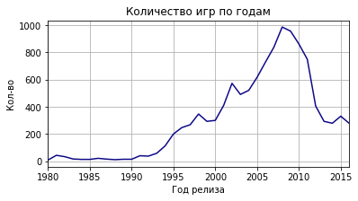


<div style="border:solid green 2px; padding: 20px"> <h1 style="color:green; margin-bottom:20px">Комментарий наставника</h1>
    
Наглядная визуализация получилась, здорово, что не забывавешь подписывать оси на графиках и сам график

На мой взгляд данные за весь период нам будут не очень инетерсны, так как основной рост в кол-ве выпускаемых игр пришелся на время запуска Sony Playstation + когда компьютеры стали более популярны в частных целях и они стали более доступные в домашних условиях использования. Мне кажется можно ограничиться последним десятилетием 


### 2) Посмотрите, как менялись продажи по платформам. Выберите платформы с наибольшими суммарными продажами и постройте распределение по годам. За какой характерный срок появляются новые и исчезают старые платформы?


```python
#  Функция глобальные продажи по платформам
def total_sales_per_platform_for(df):
    return (
        df
            .pivot_table(index='platform', values='total_sales', aggfunc='sum')
            .sort_values('total_sales', ascending=False)
    )
```


```python
# Столбчатая диаграмма глобальных продаж
def bar_plot(df):
    (
        df
            .plot(kind='bar', y='total_sales', figsize=(10, 5), grid=True, legend=False)
            .set(xlabel='Платформа', ylabel='Глобальные продажи')
    )
    plt.show()
```


```python
bar_plot(total_sales_per_platform_for(games))
```


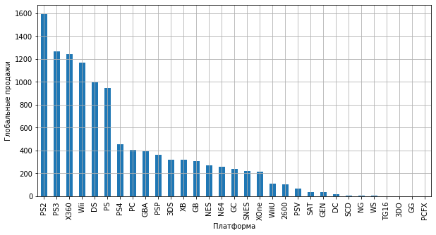


Выберем платформы с наибольшими глобальными продажами, например, первые 5 из списка выше и построим распределение по годам.


```python
top5 = total_sales_per_platform_for(games).head(5)

```


```python
top5
```


<div>
<style scoped>
    .dataframe tbody tr th:only-of-type {
        vertical-align: middle;
    }

    .dataframe tbody tr th {
        vertical-align: top;
    }

    .dataframe thead th {
        text-align: right;
    }
</style>
<table border="1" class="dataframe">
  <thead>
    <tr style="text-align: right;">
      <th></th>
      <th>total_sales</th>
    </tr>
    <tr>
      <th>platform</th>
      <th></th>
    </tr>
  </thead>
  <tbody>
    <tr>
      <td>PS2</td>
      <td>1595.06</td>
    </tr>
    <tr>
      <td>PS3</td>
      <td>1269.94</td>
    </tr>
    <tr>
      <td>X360</td>
      <td>1242.18</td>
    </tr>
    <tr>
      <td>Wii</td>
      <td>1169.72</td>
    </tr>
    <tr>
      <td>DS</td>
      <td>995.01</td>
    </tr>
  </tbody>
</table>
</div>


```python
def yearly_total_sales_by_platform(name, df):
    
    #Глобальные продажи по платформе по годам
    
    return (
        df
            .query("platform == @name")
            .pivot_table(index='year_of_release', values='total_sales', aggfunc='sum')
            .sort_values('year_of_release', ascending=False)
    )
```


```python
# Линейный график глобальных продаж по платформе по годам
for platform in list(top5.index):
    yearly_total_sales_by_platform(platform, games)['total_sales'].plot(figsize=(10, 5), grid=True, label=platform)
    plt.xlabel("Год релиза", labelpad=10)
    plt.ylabel("Глобальные продажи", labelpad=50)
    plt.legend()
```


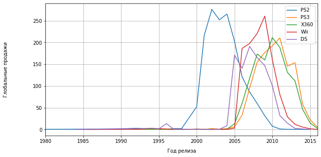


~ 10 лет срок жизни платформы. Таким образом, мы еще раз убедились, что данные за все периоды нам не понадобятся – достаточно определить актуальный период в 10 лет и смотреть на игры на современных платформах.


```python

actual_years = (games['year_of_release'] > 2006) & (games['year_of_release'] <= 2016)
actual_games = games.loc[actual_years]
```


```python
actual_years
```


    0        False
    1        False
    2         True
    3         True
    4        False
             ...  
    16710     True
    16711    False
    16712     True
    16713    False
    16714     True
    Name: year_of_release, Length: 16713, dtype: bool


### 3) Какие платформы лидируют по продажам, растут или падают? Выберите несколько потенциально прибыльных платформ.


```python
total_sales = total_sales_per_platform_for(actual_games)

```


```python
bar_plot(total_sales)

```


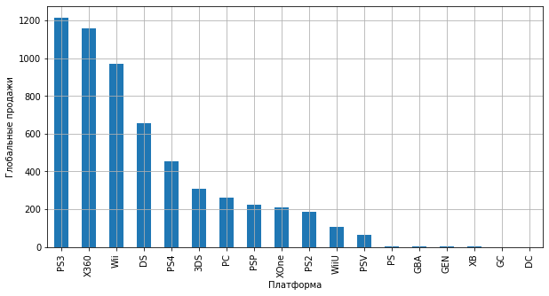


```python
# список платформ за актуальный период
platforms = list(total_sales.index)

# график из 6 строк
rows = 6
cols = (len(platforms) // rows)
fig, ax = plt.subplots(rows, cols)

# построение графиков продаж по каждой платформе
num = 0
for row in range(rows):
    for col in range(cols):
        platform = platforms[num]
        (
            yearly_total_sales_by_platform(platform, actual_games)['total_sales']
                .plot(ax=ax[row, col], figsize=(20, 20), grid=True, title=platform)
                .set(xlabel='Год релиза', ylabel='Глобальные продажи')
        )
        num += 1

plt.tight_layout()
plt.show()
```

    /opt/conda/lib/python3.7/site-packages/pandas/plotting/_matplotlib/core.py:1085: UserWarning: Attempting to set identical left == right == 2011.0 results in singular transformations; automatically expanding.
      ax.set_xlim(left, right)


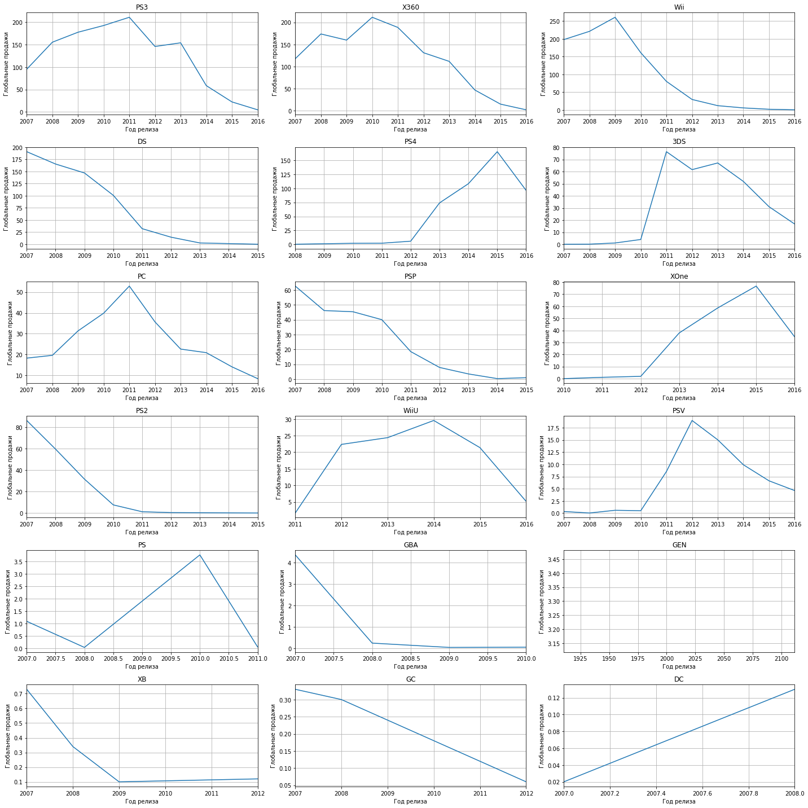


По графикам видим, что несмотря на лидирующие продажи за актуальный период, эра большинства платформ подходит к концу и продажи значительно падают. Из перспективных – консоли нового поколения:

- PS4: ~100 млн.
- XOne: ~40 млн.
Из портативных только 3DS от Nintendo пока еще держится в топе по продажам за 2016 год (около 20 млн).

Объем продаж компьютерных игр с каждым годом все меньше.

<div style="border:solid green 2px; padding: 20px"> <h1 style="color:green; margin-bottom:20px">Комментарий наставника</h1>
    
С выводами согласен

### 4) Постройте график «ящик с усами» по глобальным продажам каждой игры и разбивкой по платформам. Велика ли разница в продажах? А в средних продажах на разных платформах?


```python
promising_platforms = ['PS4', 'XOne']

fig, axs = plt.subplots(1, 2, sharey=True)

# построение графиков продаж по каждой платформе
for num, platform in enumerate(promising_platforms):
    df = yearly_total_sales_by_platform(platform, actual_games)
    print(f"Среднее значение глобальных продаж игр для {platform}: {df['total_sales'].mean()}")
    df.boxplot('total_sales', ax=axs[num])
    axs[num].set_title(platform)

#plt.tick_params(labelcolor='none', bottom='off')
plt.subplots_adjust(left=0.1)
plt.show()
```

    Среднее значение глобальных продаж игр для PS4: 56.82250000000003
    Среднее значение глобальных продаж игр для XOne: 30.114285714285717


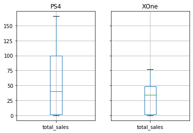


Сумма глобальных продаж игр для PS4 примерно в 2 раза больше чем у Xbox One

<div style="border:solid green 2px; padding: 20px"> <h1 style="color:green; margin-bottom:20px">Комментарий наставника</h1>
    
Тут тоже всё верно

### 5) Посмотрите, как влияют на продажи внутри одной популярной платформы отзывы пользователей и критиков.


```python
ps4 = actual_games.query("platform == 'PS4'")
xone = actual_games.query("platform == 'XOne'")
```


```python
features = ['user_score', 'critic_score', 'total_sales']
ps4[features].corr()
```


<div>
<style scoped>
    .dataframe tbody tr th:only-of-type {
        vertical-align: middle;
    }

    .dataframe tbody tr th {
        vertical-align: top;
    }

    .dataframe thead th {
        text-align: right;
    }
</style>
<table border="1" class="dataframe">
  <thead>
    <tr style="text-align: right;">
      <th></th>
      <th>user_score</th>
      <th>critic_score</th>
      <th>total_sales</th>
    </tr>
  </thead>
  <tbody>
    <tr>
      <td>user_score</td>
      <td>1.000000</td>
      <td>0.558747</td>
      <td>-0.038210</td>
    </tr>
    <tr>
      <td>critic_score</td>
      <td>0.558747</td>
      <td>1.000000</td>
      <td>0.390762</td>
    </tr>
    <tr>
      <td>total_sales</td>
      <td>-0.038210</td>
      <td>0.390762</td>
      <td>1.000000</td>
    </tr>
  </tbody>
</table>
</div>


```python
xone[features].corr()
```


<div>
<style scoped>
    .dataframe tbody tr th:only-of-type {
        vertical-align: middle;
    }

    .dataframe tbody tr th {
        vertical-align: top;
    }

    .dataframe thead th {
        text-align: right;
    }
</style>
<table border="1" class="dataframe">
  <thead>
    <tr style="text-align: right;">
      <th></th>
      <th>user_score</th>
      <th>critic_score</th>
      <th>total_sales</th>
    </tr>
  </thead>
  <tbody>
    <tr>
      <td>user_score</td>
      <td>1.000000</td>
      <td>0.472462</td>
      <td>-0.061181</td>
    </tr>
    <tr>
      <td>critic_score</td>
      <td>0.472462</td>
      <td>1.000000</td>
      <td>0.417843</td>
    </tr>
    <tr>
      <td>total_sales</td>
      <td>-0.061181</td>
      <td>0.417843</td>
      <td>1.000000</td>
    </tr>
  </tbody>
</table>
</div>


```python

ps4.plot(x='user_score', y='total_sales', kind='scatter', title='PS4')
xone.plot(x='user_score', y='total_sales', kind='scatter', title='Xbox One', color='green')
plt.show()
```


```python
ps4.plot(x='critic_score', y='total_sales', kind='scatter', title='PS4')
xone.plot(x='critic_score', y='total_sales', kind='scatter', title='Xbox One', color='green')
plt.show()
```


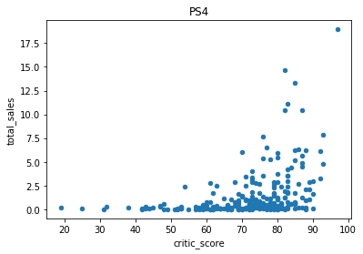


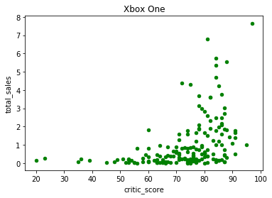


Выводы:

- Взаимосвязи между отзывами пользователей и продажами нет;
- Взаимосвязь между отзывами критиков и продажами существует, однако не слишком большая;
- Взаимосязь между отзывами критиков и отзывами пользователей существует, чуть большая чем между отзывами критиков и продажами.
- Корреляция не говорит о причинно-следственной связи. И хотя по диаграммам рассеяния видим, что чем выше оценки критиков, тем выше продажи игр на обоих платформах, мы не можем утверждать, что высокие оценки критиками приводят к высоким продажам игр, а при покупке игры пользователи больше доверяют критикам, а не заядлым игроманам

<div style="border:solid green 2px; padding: 20px"> <h1 style="color:green; margin-bottom:20px">Комментарий наставника</h1>

очень детально подходишь к работе, верные выводы, здорово!)

### 6) Посмотрите на общее распределение игр по жанрам.


```python
(actual_games
    .pivot_table(index='genre', values='total_sales')
    .sort_values('total_sales', ascending=False)
    .plot(kind='bar', y='total_sales', figsize=(10, 5), grid=True, legend=False)
    .set(xlabel='Жанр', ylabel='Глобальные продажи'))

plt.show()
```


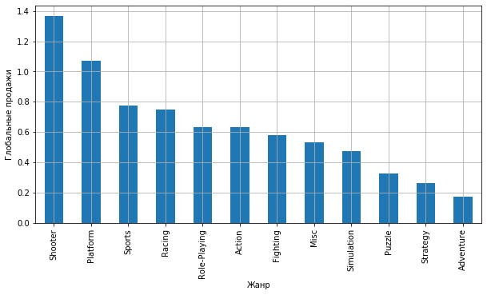


 Самыми популярными жанрами
 являются шутеры, платформеры, а также спортивные игры. Хуже всего продаются стратегии и квесты.

<div style="border:solid green 2px; padding: 20px"> <h1 style="color:green; margin-bottom:20px">Комментарий наставника</h1>
    
Платформы проанализированны и всё выполнено правильно, радует, что пишешь выводы! теперь можно посмотреть и на портреты пользователей по регионам

## 4. Портрет пользователя каждого региона


#### North America


```python
plt.style.use('seaborn')

```


```python
region = 'na_sales'

```


```python
def top5_in_region(column):
    return (
        actual_games
            .pivot_table(index=column, values=region, aggfunc='sum')
            .sort_values(region, ascending=False)
            .head(5)
    )
```


```python
def sales_pie_by_region(df):
    (
        df
            .plot(kind='pie', y=region, autopct='%1.0f%%', figsize=(10, 5), legend=False)
            .set(ylabel='Продажи')
    )
    plt.show()
```

##### Самые популярные платформы (топ-5)


```python
sales_pie_by_region(top5_in_region('platform'))

```


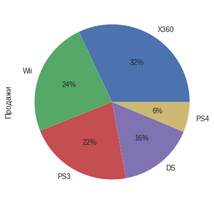


В Северной Америке Самая популярная платформа XBox, это объясняется тем что произвоит её Microsoft

##### Самые популярные жанры (топ-5)


```python
sales_pie_by_region(top5_in_region('genre'))

```


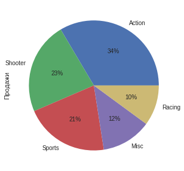


 Экшены и шутеры – самые популярные жанры.

##### Влияет ли рейтинг ESRB на продажи


```python
sales_pie_by_region(top5_in_region('rating'))

```


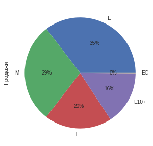


Большая часть продаж приходится на игры для детей 6+ (E) и лишь 29% приходится на взрослую аудиторию (М)

#### Europe


```python
region = 'eu_sales'

```

##### Самые популярные платформы (топ-5)


```python
sales_pie_by_region(top5_in_region('platform'))
```


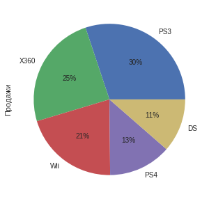


Самая популярная платформа Playstation, Xbox на втором месте

##### Самые популярные жанры (топ-5)


```python
sales_pie_by_region(top5_in_region('genre'))

```


 Экшены и шутеры – самые популярные жанры.

##### Влияет ли рейтинг ESRB на продажи


```python
sales_pie_by_region(top5_in_region('rating'))

```


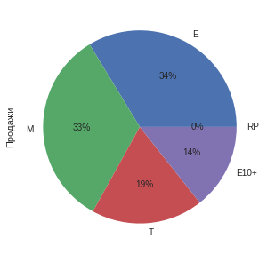


В целом картина очень похожа на Северную америку, только игры для взрослых блиде поднятунись в играм из категории 6+

#### Japan


```python
region = 'jp_sales'

```

##### Самые популярные платформы (топ-5)


```python
sales_pie_by_region(top5_in_region('platform'))
```


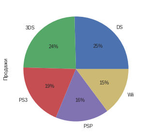


В Японии картина продаж кардинально меняется. Японцы много играют на портативных консолях типа Nintento (3)DS, PSP и пр. Здесь мы практически не видим присутствия Xbox в пятерке лидеров.


##### Самые популярные жанры (топ-5)


```python
sales_pie_by_region(top5_in_region('genre'))

```


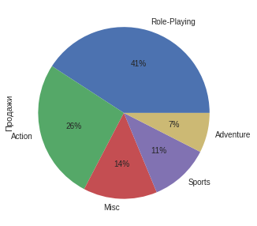


Ролевые игры  – самые популярные. К слову, экшены отстают по продажам примерно в полтора раза.


#### Влияет ли рейтинг ESRB на продажи


```python
sales_pie_by_region(top5_in_region('rating'))

```


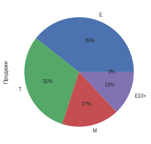


В Японии хуже всего продаются игры для взрослой аудитории – всего 17% продаж.

<div style="border:solid green 2px; padding: 20px"> <h1 style="color:green; margin-bottom:20px">Комментарий наставника</h1>

Портреты пользователей построены, все выводы правильные, продолжай в том же духе!

## 5. Проверка гипотез


Для каждой из приведенных ниже гипотез проверим две (двусторонние) гипотезы о равенстве среднего двух генеральных совокупностей по взятым из них выборкам. Чтобы понять, различаются ли пользовательские рейтинги и значима ли разница между средними значениями, проведем статистические тесты.

#### Cредние пользовательские рейтинги платформ Xbox One и PC одинаковые
Мы рассматриваем две генеральные сопокупности – игры на разных платформах.

- Нулевая гипотеза H₀:

Средние пользовательские рейтинги платформ Xbox One и PC одинаковые.

- Исходя из H₀ формулируем альтернативную гипотезу H₁:

Средние пользовательские рейтинги платформ Xbox One и PC различаются.

Пороговое значение alpha (критический уровень статистической значимости) зададим равным 3%. 


```python
alpha = .03

```


```python
pc = actual_games.query("platform == 'PC'")

results = st.ttest_ind(
    xone['user_score'],
    pc['user_score'],
    equal_var=False,  # Welch’s t-test, который не предполагает равенство дисперсий
    nan_policy='omit' # игнорируем пропуски
)

print('p-значение:', results.pvalue)

if (results.pvalue < alpha):
    print("Отвергаем нулевую гипотезу")
else:
    print("Не получилось отвергнуть нулевую гипотезу")
```

    p-значение: 0.029951657643345574
    Отвергаем нулевую гипотезу


```python
pc['user_score'].mean()

```


    6.770790378006873


```python
xone['user_score'].mean()

```


    6.508839779005524


p-value получили равным ~3%. Если бы рейтинги пользователей НЕ отличались (наша нулевая гипотеза), то те различия, что мы фактически видим, могли бы получиться случайно лишь в 3% случаев. Это весьма маленькая вероятность. Таким образом, различия довольно высокие для предположения равенства рейтингов. Но так как мы задали жесткий уровень значимости (0.025), то говорим, что тем не менее не будем отклонять гипотезу, но со стандартным уровнем в 0.05 мы бы ее уже отвергли.

Гипотеза Средние пользовательские рейтинги платформ Xbox One и PC одинаковые подтвердилась.

#### Средние пользовательские рейтинги жанров Action и Sports разные
Мы рассматриваем две генеральные сопокупности – игры разных жанров.

- Нулевая гипотеза H₀:

Средние пользовательские рейтинги жанров Action и Sports одинаковые.

- Исходя из H₀ формулируем альтернативную гипотезу H₁:

Средние пользовательские рейтинги жанров Action и Sports различаются.

Пороговое значение alpha (критический уровень статистической значимости) зададим равным 5%.


```python
alpha = .05

```


```python
action = actual_games.query("genre == 'Action'")
sports = actual_games.query("genre == 'Sports'")

results = st.ttest_ind(
    action['user_score'],
    sports['user_score'],
    nan_policy='omit' # игнорируем пропуски
)

print('p-значение:', results.pvalue)

if (results.pvalue < alpha):
    print("Отвергаем нулевую гипотезу")
else:
    print("Не получилось отвергнуть нулевую гипотезу")
```

    p-значение: 2.648261415089771e-12
    Отвергаем нулевую гипотезу


Средние пользовательские рейтинги различаются, и практически нулевая вероятность говорит о том, что случайно получить такое отличие в значениях практически не получится.

Гипотеза Средние пользовательские рейтинги жанров Action и Sports разные подтвердилась.

<div style="border:solid green 2px; padding: 20px"> <h1 style="color:green; margin-bottom:20px">Комментарий наставника</h1>

Радует, что для проверки гипотез используешь правильные методы, выводы по результатам проверки тоже правильные, молодец

## 6. Общий вывод


Тезисы:

- Платформы появляются и умирают в течение 10 лет.
- Наиболее популярные на данный момент платформы – это Sony PlayStation 4 и Xbox One. Они появились пару лет назад и имеют потенциал роста.
- В США и Европе лучше всего продаются шутеры и экшены.
- Япония – отдельный рынок с уклоном в портативные консоли и ролевые игры.
- Больше всего продаж приходятся на игры, разрешенные для детей.

Обе сформулированные гипотезы подтвердились:

- Средние пользовательские рейтинги платформ Xbox One и PC одинаковые.
- Средние пользовательские рейтинги жанров Action и Sports разные.

<div style="border:solid orange 2px; padding: 20px"> <h1 style="color:orange; margin-bottom:20px">Комментарий наставника</h1>

Вывод можно было бы написать и подробнее можно, а так же можно давать советы по использованию данного анализа в будущем

<div style="border:solid green 2px; padding: 20px"> <h1 style="color:green; margin-bottom:20px">Комментарий наставника</h1>

Ты проделал колоссальную работу и я очень рад за тебя! Удачи на следующем этапе!


```python
def summ (a, b):
    
    a = a + b
    return a
```


```python

```


```python

```
